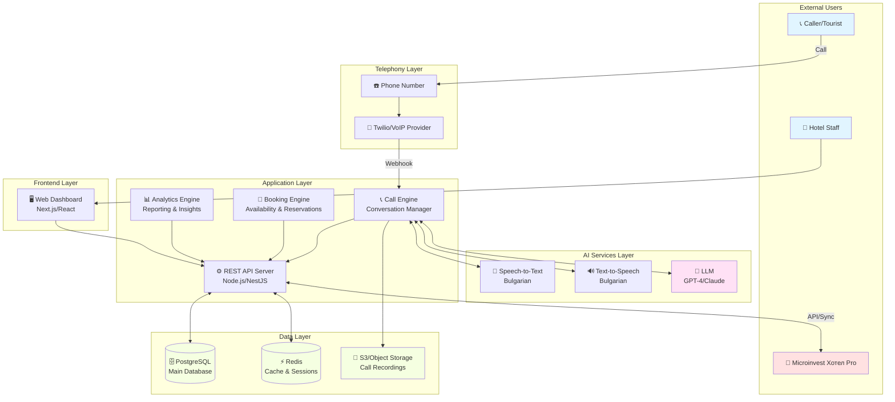
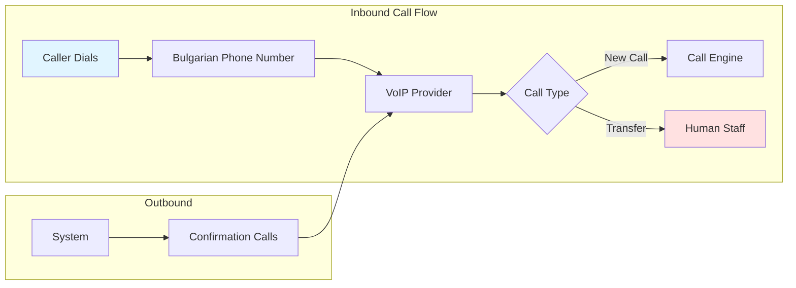
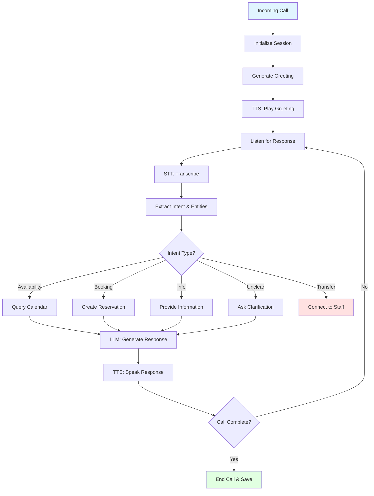
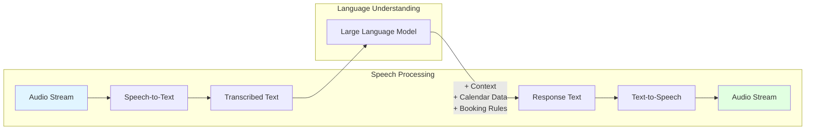
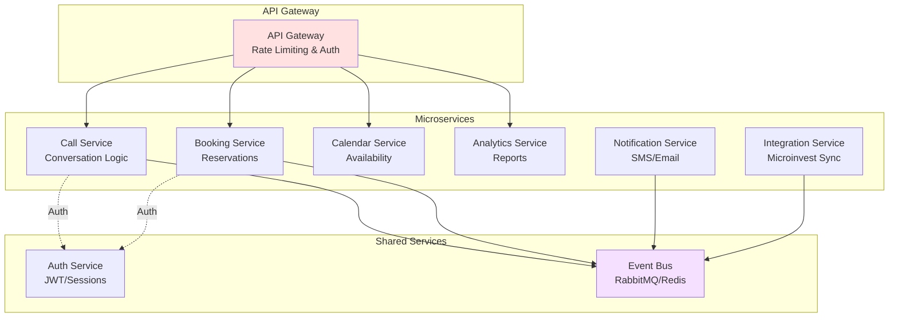
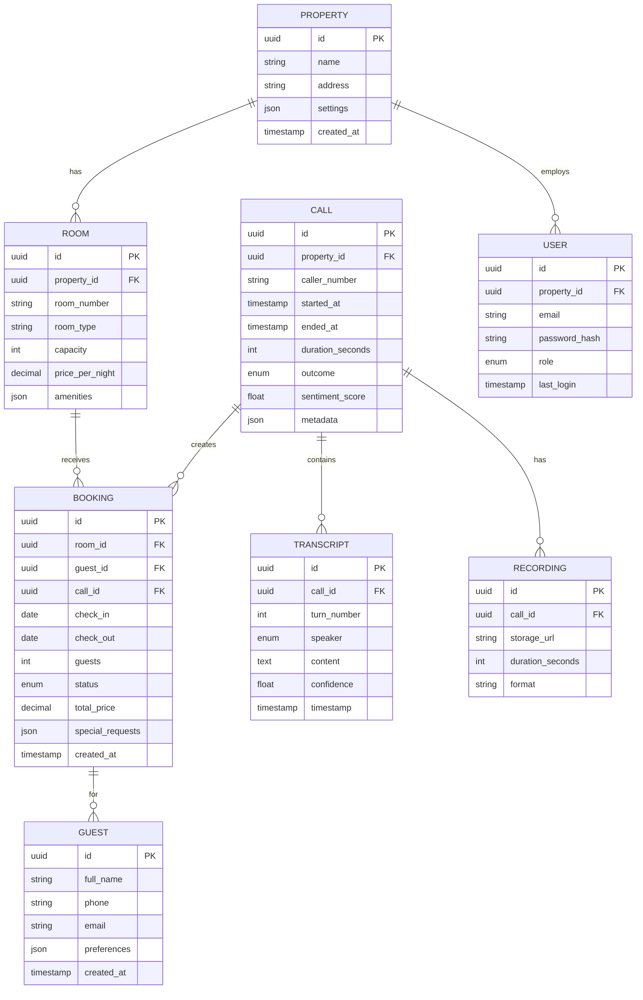
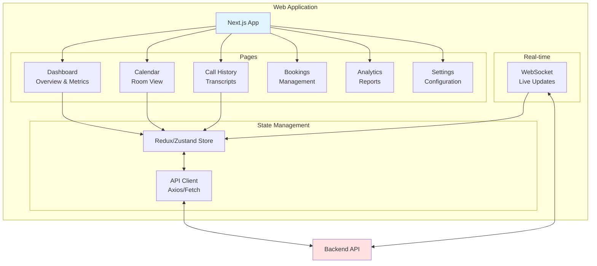
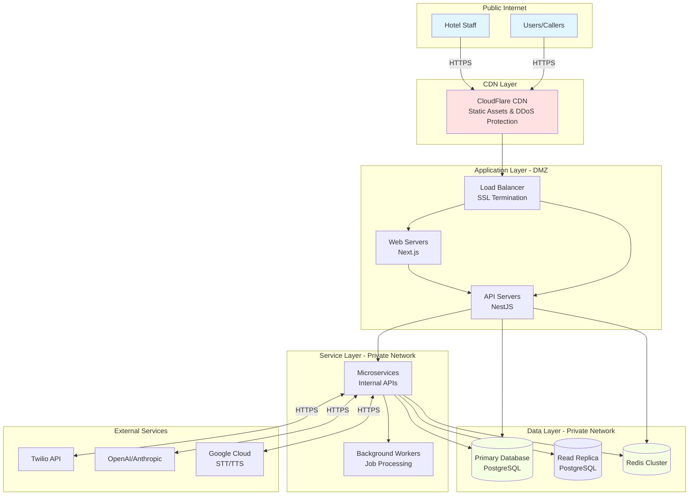
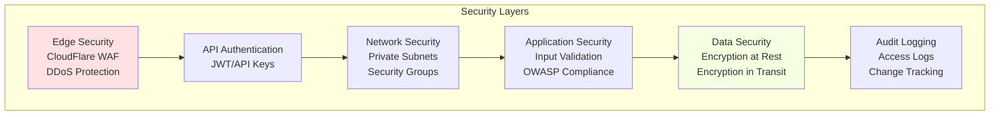
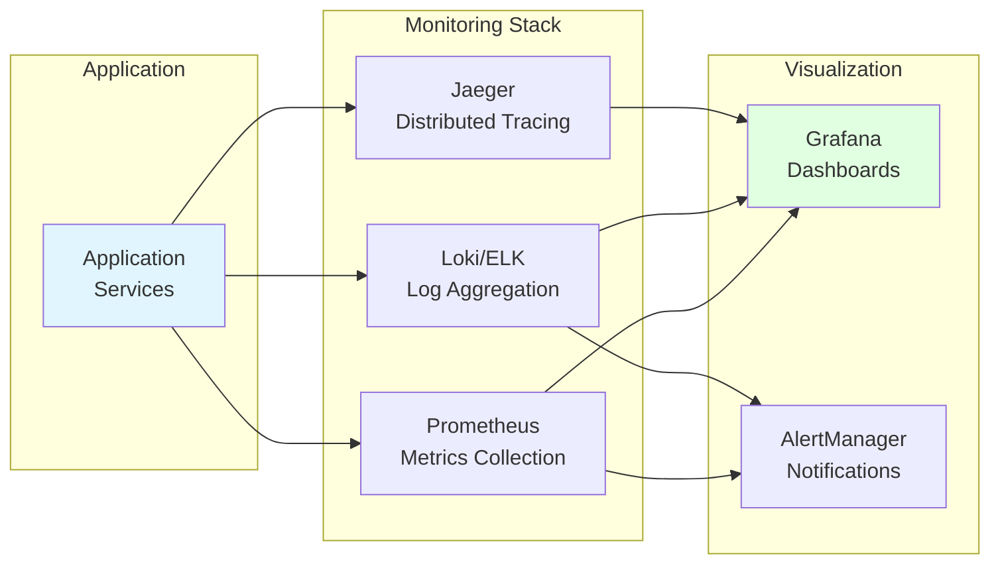

# System Architecture

## Overview

The Virtual Receptionist system follows a microservices-based, cloud-native architecture designed for scalability, reliability, and maintainability. The system is composed of several key components that work together to provide seamless voice-based booking services.

## High-Level Architecture



## Component Architecture

### 1. Telephony Layer



**Responsibilities:**
- Route incoming calls to the system
- Provide Bulgarian local/toll-free numbers
- Handle call recording
- Manage call quality and reliability
- Support call transfer to human staff

**Key Technologies:**
- **Primary**: Twilio (international, proven reliability)
- **Alternative**: Vonage, or Bulgarian providers (Vivacom Business, A1 Bulgaria)
- **Protocols**: SIP, WebRTC for voice transmission

### 2. Call Engine (Conversation Manager)



**Responsibilities:**
- Manage conversation state and context
- Coordinate between STT, TTS, and LLM services
- Handle interruptions and context switching
- Implement conversation timeout logic
- Log all interactions for analytics

**Core Features:**
- **Session Management**: Maintain conversation context across turns
- **Intent Recognition**: Classify user requests (availability, booking, info, etc.)
- **Entity Extraction**: Extract dates, room types, guest counts, names, contact info
- **Context Awareness**: Remember previous turns in conversation
- **Fallback Handling**: Transfer to human when confidence is low

### 3. AI Services Integration



**Speech-to-Text (STT) Options:**
1. **Google Cloud Speech-to-Text**
   - Excellent Bulgarian support
   - Real-time streaming
   - Cost: ~$0.006/15 seconds

2. **Azure Speech Services**
   - Good Bulgarian quality
   - Custom model training available
   - Cost: ~$1/hour

3. **OpenAI Whisper API**
   - Excellent accuracy
   - May require optimization for Bulgarian
   - Cost: ~$0.006/minute

**Text-to-Speech (TTS) Options:**
1. **Google Cloud TTS**
   - Natural Bulgarian voices (WaveNet)
   - Multiple voice options
   - Cost: ~$4/1M characters (WaveNet)

2. **Azure Neural TTS**
   - High-quality Bulgarian voices
   - SSML support for control
   - Cost: ~$16/1M characters

3. **ElevenLabs**
   - Most natural voices available
   - Custom voice cloning possible
   - Cost: ~$0.18/1000 characters (higher quality)

**LLM Options:**
1. **OpenAI GPT-4 Turbo**
   - Excellent reasoning and Bulgarian
   - Function calling for booking actions
   - Cost: ~$0.01/1K input tokens, ~$0.03/1K output tokens

2. **Anthropic Claude 3.5 Sonnet**
   - Strong reasoning, excellent instruction following
   - Good Bulgarian support
   - Cost: ~$0.003/1K input tokens, ~$0.015/1K output tokens

3. **Azure OpenAI**
   - Same models with EU data residency
   - GDPR compliant
   - Similar pricing to OpenAI

### 4. Backend Services Architecture



**Service Breakdown:**

**Call Service**
- Handles conversation orchestration
- Manages AI service integration
- Stores call transcripts and metadata
- Implements business logic for call flow

**Booking Service**
- Creates and manages reservations
- Validates booking constraints
- Calculates pricing (if applicable)
- Sends confirmations

**Calendar Service**
- Manages room availability
- Handles date range queries
- Syncs with Microinvest
- Optimizes availability searches

**Analytics Service**
- Aggregates call data
- Generates reports and metrics
- Provides dashboard data
- Exports data in various formats

**Notification Service**
- Sends booking confirmations (SMS/Email)
- Alerts staff of special requests
- Reminder notifications

**Integration Service**
- Syncs with Microinvest Хотел Pro
- Handles data transformations
- Manages sync schedules
- Error handling and retry logic

### 5. Data Architecture



**Database Technology:** PostgreSQL
- **Why**: ACID compliance, JSON support, mature ecosystem
- **Scaling**: Read replicas for analytics queries
- **Backup**: Daily automated backups with point-in-time recovery

**Caching Layer:** Redis
- Session storage for active calls
- Availability cache (TTL: 5 minutes)
- Rate limiting counters
- Real-time analytics aggregations

**Object Storage:** AWS S3 / DigitalOcean Spaces
- Call recordings (audio files)
- Exported reports
- Backup archives
- Retention: 90 days for calls, 7 years for bookings

### 6. Frontend Architecture



**Technology Stack:**
- **Framework**: Next.js 14 (React)
- **UI Components**: shadcn/ui or Material-UI
- **State Management**: Zustand or Redux Toolkit
- **API Client**: Axios with React Query for caching
- **Real-time**: Socket.io or WebSocket for live call updates
- **Charts**: Recharts or Chart.js for analytics
- **Calendar**: FullCalendar or react-big-calendar

## Network Architecture



## Deployment Architecture

### Development Environment
```
- Local development with Docker Compose
- Mock AI services for cost efficiency
- SQLite or PostgreSQL in container
- Hot reload for rapid development
```

### Staging Environment
```
- Kubernetes cluster (3 nodes)
- Actual AI services with quota limits
- PostgreSQL managed database
- Subset of production data
- Same infrastructure as production
```

### Production Environment
```
- Kubernetes cluster (5+ nodes, auto-scaling)
- Multi-region for high availability
- Managed PostgreSQL with replication
- Redis cluster (3+ nodes)
- Full monitoring and alerting
- Automatic backups
```

## Security Architecture



**Security Measures:**
1. **Authentication**: JWT tokens with refresh mechanism
2. **Authorization**: Role-based access control (RBAC)
3. **Encryption**: TLS 1.3 for transit, AES-256 for rest
4. **Data Privacy**: GDPR compliance, data minimization
5. **Audit Trail**: Complete logging of all data access
6. **Secrets Management**: HashiCorp Vault or AWS Secrets Manager
7. **Network Isolation**: Private subnets for databases and services

## Scalability Considerations

### Horizontal Scaling
- **API Servers**: Auto-scale based on CPU/memory (2-20 instances)
- **Worker Nodes**: Scale based on queue depth
- **Database**: Read replicas for analytics queries

### Vertical Scaling
- **Database**: Upgrade instance size as data grows
- **Cache**: Increase Redis memory for larger datasets

### Performance Optimizations
1. **Caching Strategy**:
   - Room availability: 5-minute TTL
   - Static data: 1-hour TTL
   - User sessions: Redis

2. **Database Indexing**:
   - Composite indexes on (property_id, date) for availability queries
   - Full-text search indexes on transcripts

3. **CDN Usage**:
   - Static assets served from edge locations
   - API responses cached when possible

4. **Connection Pooling**:
   - Database connection pools (min: 10, max: 100)
   - HTTP keep-alive for external APIs

## Monitoring & Observability



**Key Metrics:**
- Call volume and success rate
- Response time (P50, P95, P99)
- AI service latency
- Database query performance
- Error rates by endpoint
- Cost tracking per call

**Alerting:**
- System downtime (>1 minute)
- High error rate (>5%)
- Slow response times (>3 seconds)
- Database connection pool exhaustion
- High AI service costs

## Disaster Recovery

**Backup Strategy:**
- **Database**: Continuous backup with 35-day retention
- **Point-in-time Recovery**: Up to 7 days
- **Call Recordings**: Replicated across regions
- **Configuration**: Version controlled in Git

**Recovery Objectives:**
- **RTO (Recovery Time Objective)**: 4 hours
- **RPO (Recovery Point Objective)**: 1 hour

**Failover Plan:**
1. Detect failure via monitoring
2. Promote read replica to primary
3. Update DNS/load balancer
4. Verify system health
5. Investigate root cause

## Technology Decisions Summary

| Component | Technology | Rationale |
|-----------|------------|-----------|
| **Backend** | Node.js/NestJS | TypeScript, async I/O, rich ecosystem |
| **Database** | PostgreSQL | ACID compliance, JSON support, mature |
| **Cache** | Redis | Fast, versatile, pub/sub support |
| **Frontend** | Next.js | SSR, excellent DX, React ecosystem |
| **Telephony** | Twilio | Reliable, well-documented, global reach |
| **STT** | Google Cloud Speech | Best Bulgarian support |
| **TTS** | Google Cloud TTS | Natural Bulgarian voices |
| **LLM** | OpenAI GPT-4 | Best reasoning, function calling |
| **Container** | Docker | Standard, portable |
| **Orchestration** | Kubernetes | Scalable, self-healing, industry standard |
| **Monitoring** | Prometheus + Grafana | Open source, powerful, flexible |

## Next Steps

1. Review [Technology Stack](./03-technology-stack.md) for detailed technology analysis
2. See [API Specifications](./04-api-specifications.md) for endpoint definitions
3. Check [Database Schema](./05-database-schema.md) for complete data models
4. Review [Security & Compliance](./09-security-compliance.md) for security details
