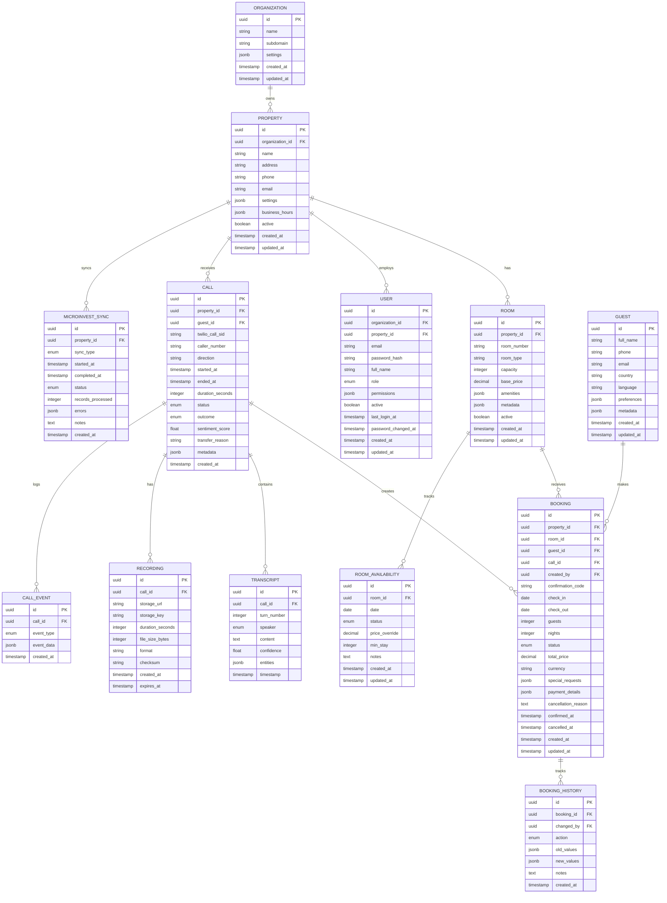

# Database Schema

## Overview

This document defines the complete database schema for the Virtual Receptionist system using PostgreSQL 16. The schema is designed for:
- **Data Integrity**: ACID compliance for bookings
- **Performance**: Optimized indexes for common queries
- **Scalability**: Partitioning strategies for high-volume tables
- **Flexibility**: JSONB columns for extensibility
- **Audit Trail**: Comprehensive tracking of changes

## Entity Relationship Diagram



## Table Definitions

### Core Tables

#### organizations

Multi-tenancy support for managing multiple hotel groups.

```sql
CREATE TABLE organizations (
    id UUID PRIMARY KEY DEFAULT gen_random_uuid(),
    name VARCHAR(255) NOT NULL,
    subdomain VARCHAR(63) UNIQUE NOT NULL,
    settings JSONB DEFAULT '{}',
    created_at TIMESTAMP NOT NULL DEFAULT NOW(),
    updated_at TIMESTAMP NOT NULL DEFAULT NOW(),

    CONSTRAINT valid_subdomain CHECK (subdomain ~ '^[a-z0-9-]+$')
);

CREATE INDEX idx_organizations_subdomain ON organizations(subdomain);
CREATE INDEX idx_organizations_created_at ON organizations(created_at);

COMMENT ON TABLE organizations IS 'Hotel groups or management companies';
COMMENT ON COLUMN organizations.subdomain IS 'Unique subdomain for multi-tenant access';
COMMENT ON COLUMN organizations.settings IS 'Organization-level configuration';
```

#### properties

Individual hotel properties.

```sql
CREATE TABLE properties (
    id UUID PRIMARY KEY DEFAULT gen_random_uuid(),
    organization_id UUID NOT NULL REFERENCES organizations(id) ON DELETE CASCADE,
    name VARCHAR(255) NOT NULL,
    address TEXT NOT NULL,
    city VARCHAR(100),
    country VARCHAR(2) DEFAULT 'BG',
    phone VARCHAR(20),
    email VARCHAR(255),
    website VARCHAR(255),
    settings JSONB DEFAULT '{}',
    business_hours JSONB DEFAULT '{
        "monday": {"open": "09:00", "close": "18:00"},
        "tuesday": {"open": "09:00", "close": "18:00"},
        "wednesday": {"open": "09:00", "close": "18:00"},
        "thursday": {"open": "09:00", "close": "18:00"},
        "friday": {"open": "09:00", "close": "18:00"},
        "saturday": {"open": "10:00", "close": "16:00"},
        "sunday": {"closed": true}
    }',
    active BOOLEAN DEFAULT true,
    created_at TIMESTAMP NOT NULL DEFAULT NOW(),
    updated_at TIMESTAMP NOT NULL DEFAULT NOW(),

    CONSTRAINT valid_country CHECK (country ~ '^[A-Z]{2}$'),
    CONSTRAINT valid_email CHECK (email ~* '^[^@]+@[^@]+\.[^@]+$')
);

CREATE INDEX idx_properties_organization ON properties(organization_id);
CREATE INDEX idx_properties_active ON properties(active) WHERE active = true;
CREATE INDEX idx_properties_country ON properties(country);
CREATE INDEX idx_properties_settings ON properties USING GIN(settings);

COMMENT ON TABLE properties IS 'Individual hotel properties';
COMMENT ON COLUMN properties.business_hours IS 'Reception hours for call routing';
COMMENT ON COLUMN properties.settings IS 'Property-specific configuration (AI prompts, pricing rules, etc.)';
```

#### rooms

Hotel rooms and their configuration.

```sql
CREATE TYPE room_type_enum AS ENUM (
    'standard',
    'deluxe',
    'suite',
    'family',
    'apartment',
    'studio',
    'penthouse'
);

CREATE TABLE rooms (
    id UUID PRIMARY KEY DEFAULT gen_random_uuid(),
    property_id UUID NOT NULL REFERENCES properties(id) ON DELETE CASCADE,
    room_number VARCHAR(20) NOT NULL,
    room_type room_type_enum NOT NULL,
    floor INTEGER,
    capacity INTEGER NOT NULL DEFAULT 2,
    base_price DECIMAL(10,2) NOT NULL,
    currency VARCHAR(3) DEFAULT 'BGN',
    amenities JSONB DEFAULT '[]',
    metadata JSONB DEFAULT '{}',
    active BOOLEAN DEFAULT true,
    created_at TIMESTAMP NOT NULL DEFAULT NOW(),
    updated_at TIMESTAMP NOT NULL DEFAULT NOW(),

    CONSTRAINT valid_capacity CHECK (capacity BETWEEN 1 AND 20),
    CONSTRAINT valid_price CHECK (base_price >= 0),
    CONSTRAINT unique_room_number UNIQUE (property_id, room_number)
);

CREATE INDEX idx_rooms_property ON rooms(property_id);
CREATE INDEX idx_rooms_type ON rooms(property_id, room_type);
CREATE INDEX idx_rooms_active ON rooms(property_id, active) WHERE active = true;
CREATE INDEX idx_rooms_capacity ON rooms(capacity);
CREATE INDEX idx_rooms_amenities ON rooms USING GIN(amenities);

COMMENT ON TABLE rooms IS 'Hotel rooms and their attributes';
COMMENT ON COLUMN rooms.amenities IS 'Array of amenity codes: ["wifi", "balcony", "sea_view", "bathtub"]';
COMMENT ON COLUMN rooms.metadata IS 'Additional room data from Microinvest or custom fields';
```

**Example amenities JSON**:
```json
{
  "amenities": [
    "wifi",
    "air_conditioning",
    "balcony",
    "sea_view",
    "bathtub",
    "minibar",
    "safe",
    "tv"
  ]
}
```

#### room_availability

Daily availability and pricing for each room.

```sql
CREATE TYPE availability_status_enum AS ENUM (
    'available',
    'occupied',
    'blocked',
    'maintenance'
);

CREATE TABLE room_availability (
    id UUID PRIMARY KEY DEFAULT gen_random_uuid(),
    room_id UUID NOT NULL REFERENCES rooms(id) ON DELETE CASCADE,
    date DATE NOT NULL,
    status availability_status_enum NOT NULL DEFAULT 'available',
    price_override DECIMAL(10,2),
    min_stay INTEGER DEFAULT 1,
    notes TEXT,
    created_at TIMESTAMP NOT NULL DEFAULT NOW(),
    updated_at TIMESTAMP NOT NULL DEFAULT NOW(),

    CONSTRAINT unique_room_date UNIQUE (room_id, date),
    CONSTRAINT valid_min_stay CHECK (min_stay >= 1)
);

-- Partition by date range for performance (monthly partitions)
CREATE INDEX idx_availability_date ON room_availability(date);
CREATE INDEX idx_availability_room_date ON room_availability(room_id, date);
CREATE INDEX idx_availability_status ON room_availability(status);
CREATE INDEX idx_availability_date_range ON room_availability(date, status) WHERE status = 'available';

COMMENT ON TABLE room_availability IS 'Daily availability calendar for each room';
COMMENT ON COLUMN room_availability.price_override IS 'Special pricing for this date (null = use base_price)';
COMMENT ON COLUMN room_availability.min_stay IS 'Minimum nights required for this date';
```

**Partitioning Strategy** (for large properties):
```sql
-- Create monthly partitions for better performance
CREATE TABLE room_availability_2025_11 PARTITION OF room_availability
    FOR VALUES FROM ('2025-11-01') TO ('2025-12-01');

CREATE TABLE room_availability_2025_12 PARTITION OF room_availability
    FOR VALUES FROM ('2025-12-01') TO ('2026-01-01');
```

#### guests

Guest information and preferences.

```sql
CREATE TABLE guests (
    id UUID PRIMARY KEY DEFAULT gen_random_uuid(),
    full_name VARCHAR(255) NOT NULL,
    phone VARCHAR(20),
    email VARCHAR(255),
    country VARCHAR(2),
    language VARCHAR(5) DEFAULT 'bg',
    preferences JSONB DEFAULT '{}',
    metadata JSONB DEFAULT '{}',
    created_at TIMESTAMP NOT NULL DEFAULT NOW(),
    updated_at TIMESTAMP NOT NULL DEFAULT NOW(),

    CONSTRAINT valid_email CHECK (email IS NULL OR email ~* '^[^@]+@[^@]+\.[^@]+$'),
    CONSTRAINT require_contact CHECK (phone IS NOT NULL OR email IS NOT NULL)
);

CREATE INDEX idx_guests_phone ON guests(phone) WHERE phone IS NOT NULL;
CREATE INDEX idx_guests_email ON guests(email) WHERE email IS NOT NULL;
CREATE INDEX idx_guests_name ON guests(full_name);
CREATE INDEX idx_guests_preferences ON guests USING GIN(preferences);

COMMENT ON TABLE guests IS 'Guest contact information and preferences';
COMMENT ON COLUMN guests.preferences IS 'Guest preferences from previous stays';
COMMENT ON COLUMN guests.metadata IS 'Additional guest data (loyalty number, special needs, etc.)';
```

**Example preferences JSON**:
```json
{
  "room_floor": "high",
  "bed_type": "king",
  "pillow_type": "soft",
  "dietary": ["vegetarian"],
  "allergies": ["peanuts"],
  "special_requests": "Quiet room away from elevator"
}
```

#### bookings

Reservation records.

```sql
CREATE TYPE booking_status_enum AS ENUM (
    'pending',
    'confirmed',
    'checked_in',
    'checked_out',
    'cancelled',
    'no_show'
);

CREATE TABLE bookings (
    id UUID PRIMARY KEY DEFAULT gen_random_uuid(),
    property_id UUID NOT NULL REFERENCES properties(id) ON DELETE RESTRICT,
    room_id UUID NOT NULL REFERENCES rooms(id) ON DELETE RESTRICT,
    guest_id UUID NOT NULL REFERENCES guests(id) ON DELETE RESTRICT,
    call_id UUID REFERENCES calls(id) ON DELETE SET NULL,
    created_by UUID REFERENCES users(id) ON DELETE SET NULL,
    confirmation_code VARCHAR(10) UNIQUE NOT NULL,
    check_in DATE NOT NULL,
    check_out DATE NOT NULL,
    guests INTEGER NOT NULL DEFAULT 1,
    nights INTEGER GENERATED ALWAYS AS (check_out - check_in) STORED,
    status booking_status_enum NOT NULL DEFAULT 'pending',
    total_price DECIMAL(10,2) NOT NULL,
    currency VARCHAR(3) DEFAULT 'BGN',
    special_requests JSONB DEFAULT '[]',
    payment_details JSONB DEFAULT '{}',
    cancellation_reason TEXT,
    confirmed_at TIMESTAMP,
    cancelled_at TIMESTAMP,
    created_at TIMESTAMP NOT NULL DEFAULT NOW(),
    updated_at TIMESTAMP NOT NULL DEFAULT NOW(),

    CONSTRAINT valid_dates CHECK (check_out > check_in),
    CONSTRAINT valid_guests CHECK (guests > 0),
    CONSTRAINT valid_price CHECK (total_price >= 0)
);

-- Generate confirmation code automatically
CREATE OR REPLACE FUNCTION generate_confirmation_code()
RETURNS VARCHAR(10) AS $$
DECLARE
    code VARCHAR(10);
    exists BOOLEAN;
BEGIN
    LOOP
        code := UPPER(SUBSTRING(MD5(RANDOM()::TEXT) FROM 1 FOR 8));
        SELECT EXISTS(SELECT 1 FROM bookings WHERE confirmation_code = code) INTO exists;
        EXIT WHEN NOT exists;
    END LOOP;
    RETURN code;
END;
$$ LANGUAGE plpgsql;

ALTER TABLE bookings
    ALTER COLUMN confirmation_code SET DEFAULT generate_confirmation_code();

CREATE INDEX idx_bookings_property ON bookings(property_id);
CREATE INDEX idx_bookings_room ON bookings(room_id);
CREATE INDEX idx_bookings_guest ON bookings(guest_id);
CREATE INDEX idx_bookings_call ON bookings(call_id) WHERE call_id IS NOT NULL;
CREATE INDEX idx_bookings_dates ON bookings(check_in, check_out);
CREATE INDEX idx_bookings_status ON bookings(property_id, status);
CREATE INDEX idx_bookings_confirmation ON bookings(confirmation_code);
CREATE INDEX idx_bookings_created ON bookings(created_at DESC);

-- Prevent double-booking
CREATE UNIQUE INDEX idx_no_double_booking ON bookings(room_id, check_in)
    WHERE status NOT IN ('cancelled', 'no_show');

COMMENT ON TABLE bookings IS 'Hotel reservations';
COMMENT ON COLUMN bookings.confirmation_code IS 'Unique 8-character booking reference';
COMMENT ON COLUMN bookings.nights IS 'Calculated number of nights';
COMMENT ON COLUMN bookings.special_requests IS 'Array of special request strings';
```

**Example special_requests JSON**:
```json
{
  "special_requests": [
    "Late check-in (after 10 PM)",
    "Extra pillow",
    "Ground floor room"
  ]
}
```

#### booking_history

Audit trail for booking changes.

```sql
CREATE TYPE booking_action_enum AS ENUM (
    'created',
    'confirmed',
    'modified',
    'cancelled',
    'checked_in',
    'checked_out',
    'no_show'
);

CREATE TABLE booking_history (
    id UUID PRIMARY KEY DEFAULT gen_random_uuid(),
    booking_id UUID NOT NULL REFERENCES bookings(id) ON DELETE CASCADE,
    changed_by UUID REFERENCES users(id) ON DELETE SET NULL,
    action booking_action_enum NOT NULL,
    old_values JSONB,
    new_values JSONB,
    notes TEXT,
    created_at TIMESTAMP NOT NULL DEFAULT NOW()
);

CREATE INDEX idx_booking_history_booking ON booking_history(booking_id, created_at DESC);
CREATE INDEX idx_booking_history_user ON booking_history(changed_by);
CREATE INDEX idx_booking_history_action ON booking_history(action);

COMMENT ON TABLE booking_history IS 'Audit log of all booking changes';
```

### Call & Conversation Tables

#### calls

Call records and metadata.

```sql
CREATE TYPE call_status_enum AS ENUM (
    'initiated',
    'ringing',
    'in_progress',
    'completed',
    'failed',
    'no_answer',
    'busy'
);

CREATE TYPE call_outcome_enum AS ENUM (
    'booking_created',
    'inquiry_only',
    'no_availability',
    'transferred_to_staff',
    'abandoned',
    'error'
);

CREATE TABLE calls (
    id UUID PRIMARY KEY DEFAULT gen_random_uuid(),
    property_id UUID NOT NULL REFERENCES properties(id) ON DELETE CASCADE,
    guest_id UUID REFERENCES guests(id) ON DELETE SET NULL,
    twilio_call_sid VARCHAR(34) UNIQUE,
    caller_number VARCHAR(20),
    direction VARCHAR(10) DEFAULT 'inbound',
    started_at TIMESTAMP NOT NULL DEFAULT NOW(),
    ended_at TIMESTAMP,
    duration_seconds INTEGER GENERATED ALWAYS AS (
        EXTRACT(EPOCH FROM (ended_at - started_at))::INTEGER
    ) STORED,
    status call_status_enum NOT NULL DEFAULT 'initiated',
    outcome call_outcome_enum,
    sentiment_score FLOAT CHECK (sentiment_score BETWEEN -1.0 AND 1.0),
    transfer_reason TEXT,
    metadata JSONB DEFAULT '{}',
    created_at TIMESTAMP NOT NULL DEFAULT NOW(),

    CONSTRAINT valid_duration CHECK (ended_at IS NULL OR ended_at >= started_at)
);

CREATE INDEX idx_calls_property ON calls(property_id, created_at DESC);
CREATE INDEX idx_calls_guest ON calls(guest_id) WHERE guest_id IS NOT NULL;
CREATE INDEX idx_calls_twilio_sid ON calls(twilio_call_sid);
CREATE INDEX idx_calls_started ON calls(started_at DESC);
CREATE INDEX idx_calls_outcome ON calls(property_id, outcome);
CREATE INDEX idx_calls_status ON calls(status) WHERE status IN ('initiated', 'ringing', 'in_progress');
CREATE INDEX idx_calls_metadata ON calls USING GIN(metadata);

COMMENT ON TABLE calls IS 'Call records and conversation metadata';
COMMENT ON COLUMN calls.sentiment_score IS 'Overall sentiment (-1 negative to +1 positive)';
COMMENT ON COLUMN calls.metadata IS 'Additional call data (language detected, topics discussed, etc.)';
```

#### transcripts

Conversation transcripts turn-by-turn.

```sql
CREATE TYPE speaker_enum AS ENUM ('ai', 'caller', 'staff');

CREATE TABLE transcripts (
    id UUID PRIMARY KEY DEFAULT gen_random_uuid(),
    call_id UUID NOT NULL REFERENCES calls(id) ON DELETE CASCADE,
    turn_number INTEGER NOT NULL,
    speaker speaker_enum NOT NULL,
    content TEXT NOT NULL,
    confidence FLOAT CHECK (confidence BETWEEN 0.0 AND 1.0),
    entities JSONB DEFAULT '[]',
    timestamp TIMESTAMP NOT NULL DEFAULT NOW(),

    CONSTRAINT unique_call_turn UNIQUE (call_id, turn_number)
);

CREATE INDEX idx_transcripts_call ON transcripts(call_id, turn_number);
CREATE INDEX idx_transcripts_speaker ON transcripts(speaker);
CREATE INDEX idx_transcripts_entities ON transcripts USING GIN(entities);

-- Full-text search on transcript content
CREATE INDEX idx_transcripts_content_search ON transcripts USING GIN(to_tsvector('bulgarian', content));

COMMENT ON TABLE transcripts IS 'Turn-by-turn conversation transcripts';
COMMENT ON COLUMN transcripts.entities IS 'Extracted entities (dates, names, room types, etc.)';
```

**Example entities JSON**:
```json
{
  "entities": [
    {"type": "date", "value": "2025-12-15", "text": "15-ти декември"},
    {"type": "room_type", "value": "deluxe", "text": "делукс стая"},
    {"type": "guest_count", "value": 2, "text": "двама"}
  ]
}
```

#### recordings

Audio recording metadata.

```sql
CREATE TABLE recordings (
    id UUID PRIMARY KEY DEFAULT gen_random_uuid(),
    call_id UUID NOT NULL REFERENCES calls(id) ON DELETE CASCADE,
    storage_url TEXT NOT NULL,
    storage_key VARCHAR(255) NOT NULL,
    duration_seconds INTEGER NOT NULL,
    file_size_bytes BIGINT,
    format VARCHAR(10) DEFAULT 'mp3',
    checksum VARCHAR(64),
    created_at TIMESTAMP NOT NULL DEFAULT NOW(),
    expires_at TIMESTAMP NOT NULL DEFAULT NOW() + INTERVAL '90 days',

    CONSTRAINT valid_duration CHECK (duration_seconds > 0),
    CONSTRAINT valid_size CHECK (file_size_bytes IS NULL OR file_size_bytes > 0)
);

CREATE INDEX idx_recordings_call ON recordings(call_id);
CREATE INDEX idx_recordings_expires ON recordings(expires_at) WHERE expires_at IS NOT NULL;

COMMENT ON TABLE recordings IS 'Call recording file metadata';
COMMENT ON COLUMN recordings.storage_url IS 'Full URL to recording file in object storage';
COMMENT ON COLUMN recordings.storage_key IS 'Object storage key for direct access';
COMMENT ON COLUMN recordings.expires_at IS 'Automatic deletion date (90 days retention)';
```

#### call_events

Detailed event log for call flow debugging.

```sql
CREATE TYPE call_event_type_enum AS ENUM (
    'call_initiated',
    'call_answered',
    'speech_detected',
    'intent_recognized',
    'availability_checked',
    'booking_created',
    'transfer_initiated',
    'call_ended',
    'error_occurred'
);

CREATE TABLE call_events (
    id UUID PRIMARY KEY DEFAULT gen_random_uuid(),
    call_id UUID NOT NULL REFERENCES calls(id) ON DELETE CASCADE,
    event_type call_event_type_enum NOT NULL,
    event_data JSONB DEFAULT '{}',
    created_at TIMESTAMP NOT NULL DEFAULT NOW()
);

CREATE INDEX idx_call_events_call ON call_events(call_id, created_at);
CREATE INDEX idx_call_events_type ON call_events(event_type, created_at DESC);
CREATE INDEX idx_call_events_data ON call_events USING GIN(event_data);

COMMENT ON TABLE call_events IS 'Detailed event log for debugging and analytics';
```

### User & Access Control

#### users

Staff user accounts.

```sql
CREATE TYPE user_role_enum AS ENUM (
    'super_admin',
    'org_admin',
    'property_manager',
    'receptionist',
    'viewer'
);

CREATE TABLE users (
    id UUID PRIMARY KEY DEFAULT gen_random_uuid(),
    organization_id UUID NOT NULL REFERENCES organizations(id) ON DELETE CASCADE,
    property_id UUID REFERENCES properties(id) ON DELETE SET NULL,
    email VARCHAR(255) UNIQUE NOT NULL,
    password_hash VARCHAR(255) NOT NULL,
    full_name VARCHAR(255) NOT NULL,
    role user_role_enum NOT NULL DEFAULT 'viewer',
    permissions JSONB DEFAULT '{}',
    active BOOLEAN DEFAULT true,
    last_login_at TIMESTAMP,
    password_changed_at TIMESTAMP DEFAULT NOW(),
    created_at TIMESTAMP NOT NULL DEFAULT NOW(),
    updated_at TIMESTAMP NOT NULL DEFAULT NOW(),

    CONSTRAINT valid_email CHECK (email ~* '^[^@]+@[^@]+\.[^@]+$')
);

CREATE INDEX idx_users_organization ON users(organization_id);
CREATE INDEX idx_users_property ON users(property_id) WHERE property_id IS NOT NULL;
CREATE INDEX idx_users_email ON users(email);
CREATE INDEX idx_users_active ON users(active) WHERE active = true;

COMMENT ON TABLE users IS 'Staff user accounts and access control';
COMMENT ON COLUMN users.property_id IS 'NULL for org-level users, specific property for property-level';
COMMENT ON COLUMN users.permissions IS 'Additional permissions beyond role defaults';
```

**Role Permissions**:
```json
{
  "super_admin": ["*"],
  "org_admin": ["manage_properties", "manage_users", "view_all_data"],
  "property_manager": ["manage_bookings", "manage_calendar", "view_analytics"],
  "receptionist": ["create_bookings", "view_bookings", "view_calls"],
  "viewer": ["view_bookings", "view_calls"]
}
```

### Integration Tables

#### microinvest_sync

Sync job tracking for Microinvest integration.

```sql
CREATE TYPE sync_type_enum AS ENUM (
    'full_sync',
    'incremental_sync',
    'manual_import'
);

CREATE TYPE sync_status_enum AS ENUM (
    'pending',
    'in_progress',
    'completed',
    'failed',
    'partial'
);

CREATE TABLE microinvest_sync (
    id UUID PRIMARY KEY DEFAULT gen_random_uuid(),
    property_id UUID NOT NULL REFERENCES properties(id) ON DELETE CASCADE,
    sync_type sync_type_enum NOT NULL,
    started_at TIMESTAMP NOT NULL DEFAULT NOW(),
    completed_at TIMESTAMP,
    status sync_status_enum NOT NULL DEFAULT 'pending',
    records_processed INTEGER DEFAULT 0,
    errors JSONB DEFAULT '[]',
    notes TEXT,
    created_at TIMESTAMP NOT NULL DEFAULT NOW(),

    CONSTRAINT valid_completed CHECK (
        (status = 'completed' AND completed_at IS NOT NULL) OR
        (status != 'completed')
    )
);

CREATE INDEX idx_microinvest_sync_property ON microinvest_sync(property_id, created_at DESC);
CREATE INDEX idx_microinvest_sync_status ON microinvest_sync(status);

COMMENT ON TABLE microinvest_sync IS 'Microinvest synchronization job history';
```

## Common Queries

### Check Room Availability

```sql
-- Find available rooms for date range
WITH date_range AS (
    SELECT generate_series(
        '2025-12-15'::DATE,
        '2025-12-20'::DATE - INTERVAL '1 day',
        '1 day'::INTERVAL
    )::DATE AS date
),
occupied_rooms AS (
    SELECT DISTINCT room_id
    FROM bookings
    WHERE property_id = :property_id
      AND status NOT IN ('cancelled', 'no_show')
      AND check_in < '2025-12-20'
      AND check_out > '2025-12-15'
),
blocked_rooms AS (
    SELECT DISTINCT room_id
    FROM room_availability
    WHERE date IN (SELECT date FROM date_range)
      AND status != 'available'
)
SELECT r.*
FROM rooms r
WHERE r.property_id = :property_id
  AND r.active = true
  AND r.id NOT IN (SELECT room_id FROM occupied_rooms)
  AND r.id NOT IN (SELECT room_id FROM blocked_rooms);
```

### Call Analytics

```sql
-- Daily call metrics
SELECT
    DATE(started_at) AS call_date,
    COUNT(*) AS total_calls,
    COUNT(*) FILTER (WHERE outcome = 'booking_created') AS bookings_created,
    ROUND(
        COUNT(*) FILTER (WHERE outcome = 'booking_created')::NUMERIC / COUNT(*) * 100,
        2
    ) AS conversion_rate,
    AVG(duration_seconds) FILTER (WHERE duration_seconds > 0) AS avg_duration,
    AVG(sentiment_score) FILTER (WHERE sentiment_score IS NOT NULL) AS avg_sentiment
FROM calls
WHERE property_id = :property_id
  AND started_at >= NOW() - INTERVAL '30 days'
GROUP BY DATE(started_at)
ORDER BY call_date DESC;
```

### Booking Revenue

```sql
-- Monthly revenue by room type
SELECT
    DATE_TRUNC('month', check_in) AS month,
    r.room_type,
    COUNT(*) AS bookings,
    SUM(b.nights) AS total_nights,
    SUM(b.total_price) AS total_revenue,
    AVG(b.total_price / b.nights) AS avg_price_per_night
FROM bookings b
JOIN rooms r ON r.id = b.room_id
WHERE b.property_id = :property_id
  AND b.status NOT IN ('cancelled', 'no_show')
  AND b.check_in >= '2025-01-01'
GROUP BY month, r.room_type
ORDER BY month DESC, total_revenue DESC;
```

## Indexes Summary

| Table | Index | Type | Purpose |
|-------|-------|------|---------|
| bookings | idx_bookings_dates | B-tree | Date range queries |
| bookings | idx_no_double_booking | Unique | Prevent overlapping bookings |
| room_availability | idx_availability_date_range | B-tree | Fast availability checks |
| calls | idx_calls_started | B-tree | Recent calls listing |
| transcripts | idx_transcripts_content_search | GIN | Full-text search |
| calls | idx_calls_metadata | GIN | Flexible metadata queries |

## Backup & Archival Strategy

### Daily Backups
```sql
-- Automated daily backup
pg_dump voicedesk_prod | gzip > backup-$(date +%Y%m%d).sql.gz
```

### Data Retention
```sql
-- Archive old calls (>1 year) to cold storage
CREATE TABLE calls_archive (LIKE calls INCLUDING ALL);

-- Move old data
WITH archived AS (
    DELETE FROM calls
    WHERE started_at < NOW() - INTERVAL '1 year'
    RETURNING *
)
INSERT INTO calls_archive SELECT * FROM archived;
```

### Automatic Cleanup
```sql
-- Delete expired recordings (cron job)
DELETE FROM recordings
WHERE expires_at < NOW();

-- Delete old call events (keep 90 days)
DELETE FROM call_events
WHERE created_at < NOW() - INTERVAL '90 days';
```

## Performance Optimization

### Partitioning
Large tables (calls, transcripts) should be partitioned by date:

```sql
CREATE TABLE calls_partitioned (LIKE calls INCLUDING ALL)
PARTITION BY RANGE (started_at);

CREATE TABLE calls_2025_11 PARTITION OF calls_partitioned
    FOR VALUES FROM ('2025-11-01') TO ('2025-12-01');
```

### Connection Pooling
```typescript
// PgBouncer configuration
{
  "pool_mode": "transaction",
  "max_client_conn": 1000,
  "default_pool_size": 25
}
```

## Next Steps

1. Review [API Specifications](./04-api-specifications.md) for how this data is accessed
2. See [Implementation Roadmap](./10-implementation-roadmap.md) for migration strategy
3. Check [Security & Compliance](./09-security-compliance.md) for data protection measures
