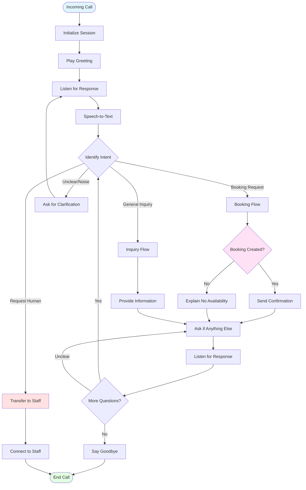
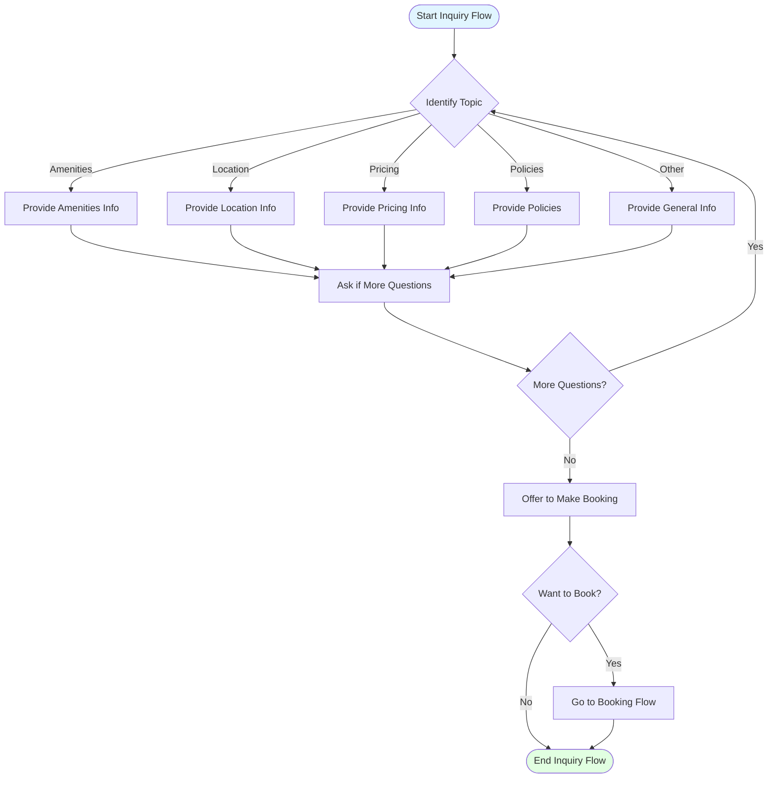
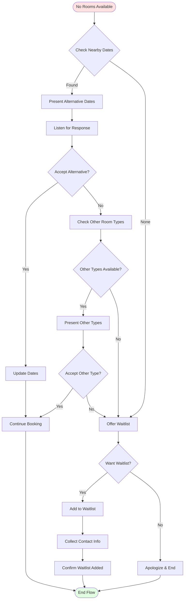
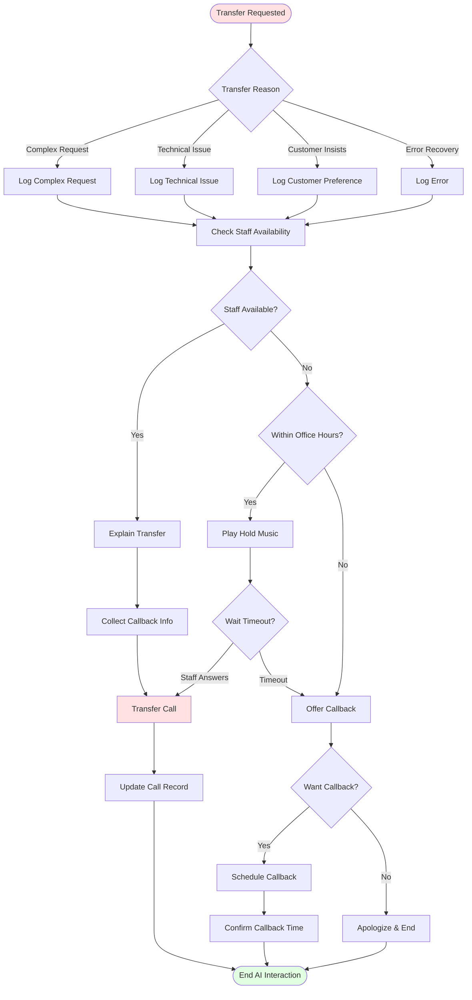
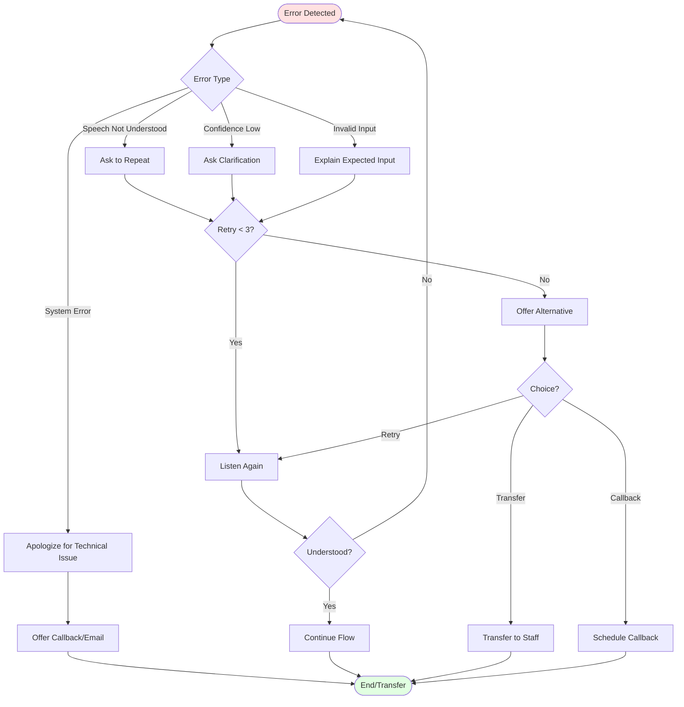

# Call Flow Diagrams

## Overview

This document details the conversation flows for the Virtual Receptionist AI system, including happy paths, error handling, and edge cases. All conversations are conducted in Bulgarian language.

---

## Main Call Flow



---

## Detailed Booking Flow

```mermaid
graph TB
    Start([Start Booking Flow]) --> AskDates[Ask Check-in/Check-out]

    AskDates --> ListenDates[Listen for Dates]
    ListenDates --> ExtractDates{Extract Dates}

    ExtractDates -->|Success| ValidDates{Dates Valid?}
    ExtractDates -->|Failed| ClarifyDates[Ask to Repeat Dates]
    ClarifyDates --> ListenDates

    ValidDates -->|Future Dates| AskGuests[Ask Number of Guests]
    ValidDates -->|Past Dates| ExplainPast[Explain Past Dates]
    ExplainPast --> AskDates

    AskGuests --> ListenGuests[Listen for Guest Count]
    ListenGuests --> ExtractGuests{Extract Count}

    ExtractGuests -->|Success| AskRoomType[Ask Room Type Preference]
    ExtractGuests -->|Failed| DefaultGuests[Default to 2 Guests]
    DefaultGuests --> AskRoomType

    AskRoomType --> ListenRoomType[Listen for Type]
    ListenRoomType --> ExtractRoomType{Extract Type}

    ExtractRoomType -->|Specified| CheckAvail[Query Availability]
    ExtractRoomType -->|Not Specified| CheckAvail

    CheckAvail --> HasRooms{Rooms Available?}

    HasRooms -->|Yes| PresentOptions[Present Available Rooms]
    HasRooms -->|No| OfferAlternatives{Alternative Dates?}

    OfferAlternatives -->|Yes| PresentAlternatives[Suggest Alternative Dates]
    OfferAlternatives -->|No| FullyBooked[Explain Fully Booked]

    PresentAlternatives --> ListenAltChoice[Listen for Choice]
    ListenAltChoice --> AcceptAlt{Accept Alternative?}
    AcceptAlt -->|Yes| CheckAvail
    AcceptAlt -->|No| FullyBooked

    PresentOptions --> ListenSelection[Listen for Room Selection]
    ListenSelection --> RoomSelected{Room Selected?}

    RoomSelected -->|Yes| CollectInfo[Collect Guest Info]
    RoomSelected -->|No| ClarifySelection[Ask to Clarify]
    ClarifySelection --> PresentOptions

    CollectInfo --> AskName[Ask Full Name]
    AskName --> ListenName[Listen for Name]
    ListenName --> ValidateName{Valid Name?}

    ValidateName -->|Yes| AskPhone[Ask Phone Number]
    ValidateName -->|No| RepeatName[Ask to Repeat]
    RepeatName --> ListenName

    AskPhone --> ListenPhone[Listen for Phone]
    ListenPhone --> ValidatePhone{Valid Phone?}

    ValidatePhone -->|Yes| AskEmail[Ask Email (Optional)]
    ValidatePhone -->|No| RepeatPhone[Ask to Repeat]
    RepeatPhone --> ListenPhone

    AskEmail --> ListenEmail[Listen for Email]
    ListenEmail --> AskSpecial[Ask Special Requests]

    AskSpecial --> ListenSpecial[Listen for Requests]
    ListenSpecial --> Summarize[Summarize Booking]

    Summarize --> Confirm{Confirm Details?}

    Confirm -->|Yes| CreateBooking[Create Booking in DB]
    Confirm -->|No| AskChange[What to Change?]

    AskChange --> ChangeWhat{Change What?}
    ChangeWhat -->|Dates| AskDates
    ChangeWhat -->|Guests| AskGuests
    ChangeWhat -->|Room Type| AskRoomType
    ChangeWhat -->|Cancel| BookingCancelled[Cancel Booking]

    CreateBooking --> BookingSuccess{Success?}

    BookingSuccess -->|Yes| ProvideConfirmation[Provide Confirmation Code]
    BookingSuccess -->|No| BookingError[Explain Error]

    ProvideConfirmation --> SendEmail[Offer Email Confirmation]
    SendEmail --> End([End Booking Flow])

    FullyBooked --> End
    BookingCancelled --> End
    BookingError --> AskRetry[Ask to Retry]
    AskRetry --> RetryChoice{Retry?}
    RetryChoice -->|Yes| AskDates
    RetryChoice -->|No| End

    style Start fill:#e1f5ff
    style End fill:#e1ffe1
    style BookingSuccess fill:#e1ffe1
    style HasRooms fill:#ffe1f5
    style CreateBooking fill:#ffe1e1
```

---

## Example Conversation: Successful Booking

### Scenario: Tourist wants to book a room for Christmas

**Turn 1 - AI Greeting:**
```
AI: Добре дошли в Хотел Слънчев Бряг! Казвам се Мария и съм вашият виртуален
рецепционист. Как мога да ви помогна днес?

(Welcome to Hotel Sunny Beach! My name is Maria and I'm your virtual
receptionist. How can I help you today?)
```

**Turn 2 - Caller Request:**
```
Caller: Здравейте, искам да резервирам стая за Коледа.

(Hello, I want to book a room for Christmas.)
```

**Turn 3 - AI Clarify Dates:**
```
AI: Чудесно! За Коледния период имаме наличност. Бихте ли ми казали точните
дати - за настаняване и напускане?

(Wonderful! We have availability for the Christmas period. Could you tell me
the exact dates - check-in and check-out?)
```

**Turn 4 - Caller Provides Dates:**
```
Caller: От 24-ти декември до 27-ми декември, три нощувки.

(From December 24th to December 27th, three nights.)
```

**Turn 5 - AI Extract Dates & Ask Guests:**
```
AI: Разбирам, от 24-ти до 27-ми декември, три нощувки. Перфектно!
За колко човека ще бъде резервацията?

(I understand, from December 24th to 27th, three nights. Perfect!
For how many people will the reservation be?)
```

**Turn 6 - Caller Provides Guest Count:**
```
Caller: За двама възрастни и едно дете.

(For two adults and one child.)
```

**Turn 7 - AI Ask Room Preference:**
```
AI: Чудесно, двама възрастни и едно дете. Имате ли предпочитание за типа стая?
Имаме стандартни стаи, делукс стаи с балкон и изглед към морето, и апартаменти.

(Great, two adults and one child. Do you have a preference for room type?
We have standard rooms, deluxe rooms with balcony and sea view, and apartments.)
```

**Turn 8 - Caller Requests Sea View:**
```
Caller: Искам стая с изглед към морето.

(I want a room with sea view.)
```

**Turn 9 - AI Check Availability & Present Options:**
```
AI: Прекрасно! Проверих наличността за вашите дати. Имам две налични стаи с
изглед към морето:

Първата е Делукс стая номер 305 на третия етаж с голям балкон, цената е
180 лева на нощувка, общо 540 лева за трите нощувки.

Втората е Делукс стая номер 412 на четвъртия етаж с джакузи, цената е
220 лева на нощувка, общо 660 лева.

И двете стаи са с двойно легло и възможност за детско легло. Коя предпочитате?

(Excellent! I checked availability for your dates. I have two available rooms
with sea view:

The first is Deluxe room 305 on the third floor with large balcony, price is
180 BGN per night, total 540 BGN for three nights.

The second is Deluxe room 412 on the fourth floor with jacuzzi, price is
220 BGN per night, total 660 BGN.

Both rooms have a double bed and option for child bed. Which do you prefer?)
```

**Turn 10 - Caller Makes Selection:**
```
Caller: Стая 305 звучи добре.

(Room 305 sounds good.)
```

**Turn 11 - AI Collect Guest Information:**
```
AI: Отлично избор! Стая 305 е ваша. Сега имам нужда от вашите данни за
резервацията. Може ли да ми кажете вашите три имена?

(Excellent choice! Room 305 is yours. Now I need your information for
the reservation. Could you tell me your full name?)
```

**Turn 12 - Caller Provides Name:**
```
Caller: Петър Георгиев Иванов.

(Petar Georgiev Ivanov.)
```

**Turn 13 - AI Ask Phone:**
```
AI: Благодаря, господин Иванов. Моля дайте ми и вашия телефонен номер.

(Thank you, Mr. Ivanov. Please give me your phone number as well.)
```

**Turn 14 - Caller Provides Phone:**
```
Caller: Нула осемстотин и осемдесет и осем, един две три, четири пет шест.

(Zero eight hundred eighty eight, one two three, four five six.)
```

**Turn 15 - AI Confirm Phone & Ask Email:**
```
AI: Записах 0888 123 456. Имате ли имейл адрес, на който да ви изпратя
потвърждение?

(I noted 0888 123 456. Do you have an email address where I can send
you confirmation?)
```

**Turn 16 - Caller Provides Email:**
```
Caller: Да, petar.ivanov@gmail.com

(Yes, petar.ivanov@gmail.com)
```

**Turn 17 - AI Ask Special Requests:**
```
AI: Перфектно. Имате ли специални пожелания или заявки за вашия престой?

(Perfect. Do you have any special requests for your stay?)
```

**Turn 18 - Caller Requests Early Check-in:**
```
Caller: Бихме искали ранно настаняване ако е възможно, пристигаме около 10 сутринта.

(We would like early check-in if possible, we arrive around 10 AM.)
```

**Turn 19 - AI Summarize & Confirm:**
```
AI: Разбрано, ще отбележа пожеланието за ранно настаняване. Позволете ми да
обобщя резервацията:

• Гост: Петър Георгиев Иванов
• Телефон: 0888 123 456
• Имейл: petar.ivanov@gmail.com
• Настаняване: 24 декември 2025
• Напускане: 27 декември 2025
• Стая: Делукс 305 с изглед към морето
• Гости: двама възрастни и едно дете
• Цена: 540 лева за три нощувки
• Специално пожелание: ранно настаняване около 10 часа

Всичко вярно ли е?

(Understood, I'll note the early check-in request. Let me summarize the reservation:

• Guest: Petar Georgiev Ivanov
• Phone: 0888 123 456
• Email: petar.ivanov@gmail.com
• Check-in: December 24, 2025
• Check-out: December 27, 2025
• Room: Deluxe 305 with sea view
• Guests: two adults and one child
• Price: 540 BGN for three nights
• Special request: early check-in around 10 AM

Is everything correct?)
```

**Turn 20 - Caller Confirms:**
```
Caller: Да, всичко е наред.

(Yes, everything is fine.)
```

**Turn 21 - AI Create Booking & Provide Confirmation:**
```
AI: Чудесно! Вашата резервация е потвърдена. Вашият код за потвърждение е
A7B9C2D1. Записах си го, нали?

Изпратих ви и имейл на petar.ivanov@gmail.com с всички детайли за резервацията.

Очакваме ви на 24-ти декември! Ще направим всичко възможно да осигурим ранно
настаняване. Има ли още нещо, с което мога да ви помогна?

(Wonderful! Your reservation is confirmed. Your confirmation code is
A7B9C2D1. Did you write it down?

I also sent you an email to petar.ivanov@gmail.com with all reservation details.

We look forward to seeing you on December 24th! We'll do our best to arrange
early check-in. Is there anything else I can help you with?)
```

**Turn 22 - Caller Declines:**
```
Caller: Не, това е всичко. Благодаря!

(No, that's all. Thank you!)
```

**Turn 23 - AI Goodbye:**
```
AI: Няма защо! Благодарим ви, че избрахте Хотел Слънчев Бряг. Довиждане и
весела Коледа!

(You're welcome! Thank you for choosing Hotel Sunny Beach. Goodbye and
Merry Christmas!)
```

---

## Inquiry Flow



### Example: Amenities Inquiry

**Caller:**
```
Имате ли басейн и фитнес в хотела?
(Do you have a pool and fitness center in the hotel?)
```

**AI Response:**
```
Да, разполагаме с отопляем външен басейн, който е отворен от май до октомври,
и фитнес зала с модерно оборудване, която работи денонощно. Имаме също и СПА
център със сауна и парна баня. Всички тези удобства са безплатни за нашите гости.

Искате ли да научите още нещо за удобствата ни?

(Yes, we have a heated outdoor pool open from May to October, and a fitness
center with modern equipment that operates 24/7. We also have a SPA center
with sauna and steam room. All these amenities are free for our guests.

Would you like to learn more about our facilities?)
```

---

## No Availability Flow



### Example: No Availability

**AI:**
```
За съжаление, за избраните от вас дати 24-27 декември всички наши стаи са
резервирани. Коледният период е много популярен.

Имам наличност за следните дати близо до вашето пожелание:
• 23-26 декември (един ден по-рано)
• 25-28 декември (един ден по-късно)
• 22-27 декември (два дни по-рано, пет нощувки)

Бихте ли разгледали някоя от тези опции?

(Unfortunately, for your selected dates December 24-27, all our rooms are
booked. The Christmas period is very popular.

I have availability for these dates close to your request:
• December 23-26 (one day earlier)
• December 25-28 (one day later)
• December 22-27 (two days earlier, five nights)

Would you consider any of these options?)
```

---

## Transfer to Human Staff Flow



### Example: Transfer Request

**Caller:**
```
Искам да говоря с човек от персонала.
(I want to speak with a person from the staff.)
```

**AI:**
```
Разбира се, ще ви свържа с нашия рецепционист. Позволете ми да проверя
наличността. Моля изчакайте момент.

[Checking staff availability...]

Колегата ми Елена е на линия и ще поеме обаждането ви. Моля, не затваряйте.

(Of course, I'll connect you with our receptionist. Let me check
availability. Please wait a moment.

[Checking staff availability...]

My colleague Elena is on the line and will take your call. Please hold.)
```

---

## Error Handling Flow



### Example: Speech Not Understood

**AI (after 2nd failed attempt):**
```
Извинявайте, имам затруднения да ви разбера ясно. Възможно е линията да не е
много добра. Бихте ли говорили малко по-бавно и по-ясно?

Или ако предпочитате, мога да ви свържа с човек от нашия екип.

(I'm sorry, I'm having difficulty understanding you clearly. The line may not
be very good. Could you speak a bit slower and more clearly?

Or if you prefer, I can connect you with someone from our team.)
```

---

## Conversation Timeout Handling

**Timeouts:**
- **No Speech Detected**: 5 seconds → Prompt
- **Long Silence**: 10 seconds → Ask if still there
- **Total Inactivity**: 30 seconds → End call gracefully

### Example:

**AI (after 10 seconds silence):**
```
Здравейте, още ли сте на линия?
(Hello, are you still on the line?)
```

**AI (after 30 seconds no response):**
```
Изглежда загубихме връзка. Ако имате нужда от помощ, моля обадете се отново.
Довиждане!
(It seems we lost connection. If you need help, please call again. Goodbye!)
```

---

## Intent Classification

### Primary Intents

| Intent | Keywords (Bulgarian) | Confidence Threshold |
|--------|---------------------|---------------------|
| **booking** | резервация, резервирам, стая, бронирам | >0.75 |
| **availability** | наличност, свободни стаи, има ли | >0.70 |
| **pricing** | цена, колко струва, тарифа | >0.70 |
| **amenities** | удобства, басейн, ресторант, wifi | >0.65 |
| **location** | къде е, как да стигна, адрес | >0.65 |
| **policies** | политика, правила, анулация | >0.70 |
| **complaint** | оплакване, проблем, недоволен | >0.75 |
| **transfer** | човек, персонал, рецепционист | >0.80 |

### Entity Extraction

| Entity | Examples | Validation |
|--------|----------|------------|
| **date** | "15-ти декември", "утре", "следващата седмица" | Parse to ISO 8601 |
| **duration** | "три нощувки", "една седмица", "уикенд" | Convert to nights |
| **guest_count** | "двама", "семейство от четирима", "един човек" | Integer 1-20 |
| **room_type** | "делукс", "стандартна", "апартамент" | Match enum |
| **name** | "Иван Петров", "Мария Георгиева" | 2-3 parts |
| **phone** | "0888 123 456", "359 2 987 6543" | Validate BG format |
| **email** | "ivan@example.com" | Validate email format |

---

## Conversation Context Management

### Context Variables

```typescript
interface ConversationContext {
  sessionId: string
  propertyId: string
  callId: string

  // Intent tracking
  currentIntent: Intent | null
  previousIntent: Intent | null

  // Booking context
  booking?: {
    checkIn?: Date
    checkOut?: Date
    guests?: number
    roomType?: RoomType
    selectedRoomId?: string
    guestInfo?: {
      fullName?: string
      phone?: string
      email?: string
    }
    specialRequests?: string[]
  }

  // Conversation state
  turnCount: number
  retryCount: number
  clarificationNeeded: boolean

  // User preferences
  language: string
  detectedSentiment: number
}
```

### Context Retention

- Context maintained for **duration of call**
- Stored in **Redis** with 1-hour TTL
- Cleared after call ends
- Logged to database for analytics

---

## Multi-Turn Dialogue Management

### State Machine

```
GREETING → LISTENING → PROCESSING → RESPONDING → LISTENING → ...
```

### Turn Structure

Each turn consists of:
1. **Listen**: Capture audio
2. **Transcribe**: STT conversion
3. **Understand**: Intent + entities
4. **Decide**: Business logic
5. **Generate**: Response text
6. **Speak**: TTS playback
7. **Log**: Save transcript

---

## Quality Assurance Triggers

### Automatic Transfer Triggers

Transfer to human staff when:
- **Low Confidence**: <60% on 2 consecutive turns
- **Negative Sentiment**: <-0.5 score
- **Complex Request**: Multiple intents detected
- **System Error**: API failures, timeouts
- **Explicit Request**: User asks for human
- **Sensitive Issue**: Payment, complaint, cancellation

---

## Next Steps

1. Review [UI/UX Design](./06-ui-ux-design.md) for dashboard interface
2. See [API Specifications](./04-api-specifications.md) for integration details
3. Check [Testing Strategy](./12-testing-strategy.md) for conversation testing
4. Review [Implementation Roadmap](./10-implementation-roadmap.md) for development phases
