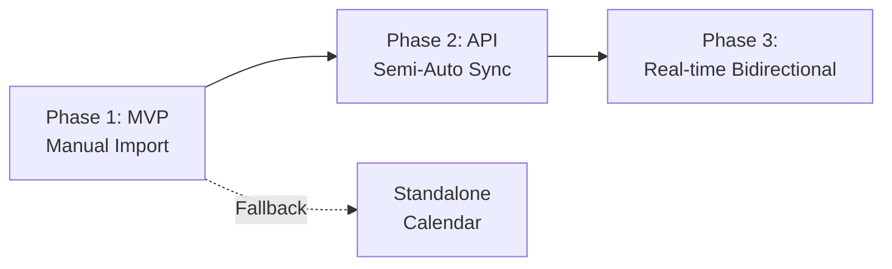

# Microinvest Integration Strategy

## Overview

Microinvest Хотел Pro is the leading hotel management system (PMS) in Bulgaria. This document outlines strategies for integrating the Virtual Receptionist system with Microinvest to synchronize room availability and bookings.

## Integration Options

### Option A: Direct API Integration (Recommended for Phase 2)

**Status**: Research needed - Microinvest API availability unclear

**Approach**:
1. Contact Microinvest for API access documentation
2. Evaluate API capabilities (read/write permissions)
3. Implement real-time bidirectional synchronization

**Pros**:
- ✅ Real-time synchronization
- ✅ Automated workflow
- ✅ Bidirectional updates
- ✅ No manual intervention

**Cons**:
- ❌ API may not be publicly available
- ❌ Potential licensing costs
- ❌ Integration complexity
- ❌ Dependency on Microinvest

### Option B: Database-Level Integration

**Status**: Requires Microinvest database schema access

**Approach**:
1. Access Microinvest database (likely SQL Server)
2. Create read-only database user
3. Query relevant tables for rooms, bookings, availability
4. Implement scheduled sync (every 15 minutes)

**Pros**:
- ✅ Direct data access
- ✅ No API limitations
- ✅ Full data visibility
- ✅ Reliable

**Cons**:
- ❌ Requires database access
- ❌ Schema changes could break integration
- ❌ May violate Microinvest ToS
- ❌ Security concerns
- ❌ Read-only (can't write back)

### Option C: Manual CSV/Excel Import (Recommended for MVP)

**Status**: Implement for Phase 1

**Approach**:
1. Hotel staff exports data from Microinvest (daily/weekly)
2. Upload CSV/Excel file to Virtual Receptionist dashboard
3. System parses and imports data
4. AI uses imported data for availability checks

**Pros**:
- ✅ Simple to implement
- ✅ No API dependency
- ✅ Works with all Microinvest versions
- ✅ Hotel maintains control

**Cons**:
- ❌ Manual process
- ❌ Not real-time
- ❌ Potential for errors
- ❌ Staff burden

### Option D: Standalone Calendar (Fallback)

**Status**: Build as fallback option

**Approach**:
1. Virtual Receptionist maintains its own calendar
2. No integration with Microinvest
3. Staff manually manages both systems
4. Periodic manual reconciliation

**Pros**:
- ✅ Complete independence
- ✅ No integration complexity
- ✅ Works for hotels without Microinvest
- ✅ Simple

**Cons**:
- ❌ Duplicate data entry
- ❌ Sync issues
- ❌ Higher staff workload
- ❌ Risk of double-booking

---

## Recommended Approach: Phased Integration



### Phase 1: Manual CSV Import (Months 1-3)

**Implementation**:
1. Build CSV/Excel import functionality
2. Create data mapping for Microinvest export format
3. Implement validation and error handling
4. Provide staff training

**Workflow**:
```
Daily (end of day):
1. Staff exports bookings from Microinvest
2. Upload CSV to Virtual Receptionist dashboard
3. System imports and validates data
4. Conflicts highlighted for manual resolution
5. AI uses updated availability
```

**Data Export from Microinvest**:
```csv
Стая,Тип,От дата,До дата,Гост,Телефон,Имейл,Статус
201,Стандартна,2025-12-15,2025-12-20,Иван Петров,0888123456,ivan@example.com,Потвърдена
305,Делукс,2025-12-18,2025-12-22,Мария Иванова,0889765432,maria@example.com,Потвърдена
```

**Import Processing**:
```typescript
async function importMicroinvestCSV(file: File) {
  // Parse CSV
  const records = await parseCSV(file)

  // Validate format
  const validation = validateMicroinvestFormat(records)
  if (!validation.valid) {
    throw new Error(`Invalid format: ${validation.errors.join(', ')}`)
  }

  // Map to our schema
  const bookings = records.map(record => ({
    roomNumber: record['Стая'],
    roomType: mapRoomType(record['Тип']),
    checkIn: parseDate(record['От дата']),
    checkOut: parseDate(record['До дата']),
    guestName: record['Гост'],
    phone: normalizePhone(record['Телефон']),
    email: record['Имейл'],
    status: mapStatus(record['Статус']),
    source: 'microinvest_import'
  }))

  // Check for conflicts
  const conflicts = await detectConflicts(bookings)

  if (conflicts.length > 0) {
    // Return conflicts for manual review
    return {
      success: false,
      conflicts,
      message: 'Конфликти открити - необходим ръчен преглед'
    }
  }

  // Import bookings
  const imported = await importBookings(bookings)

  return {
    success: true,
    imported: imported.length,
    message: `Успешно импортирани ${imported.length} резервации`
  }
}
```

### Phase 2: Semi-Automated API Sync (Months 4-6)

**Prerequisites**:
- Microinvest API documentation obtained
- API access credentials secured
- Testing environment available

**Implementation**:
1. Build Microinvest API client
2. Implement scheduled synchronization
3. Create conflict resolution logic
4. Add manual sync trigger

**Workflow**:
```
Automatic (every 15 minutes):
1. Virtual Receptionist queries Microinvest API
2. Fetch new/updated bookings
3. Compare with local data
4. Auto-resolve simple conflicts
5. Flag complex conflicts for staff

Manual (AI creates booking):
1. AI creates booking in Virtual Receptionist
2. System flags for manual entry to Microinvest
3. Staff enters booking in Microinvest
4. Next sync validates match
```

**API Client Example**:
```typescript
class MicroinvestClient {
  private apiKey: string
  private baseURL: string

  async getBookings(propertyId: string, startDate: Date, endDate: Date) {
    // Query Microinvest API
    const response = await fetch(`${this.baseURL}/bookings`, {
      method: 'GET',
      headers: {
        'Authorization': `Bearer ${this.apiKey}`,
        'Content-Type': 'application/json'
      },
      body: JSON.stringify({
        property_id: propertyId,
        start_date: startDate.toISOString(),
        end_date: endDate.toISOString()
      })
    })

    return response.json()
  }

  async createBooking(booking: MicroinvestBooking) {
    // Create booking in Microinvest
    // ...
  }

  async updateBooking(bookingId: string, updates: Partial<MicroinvestBooking>) {
    // Update booking in Microinvest
    // ...
  }
}
```

### Phase 3: Real-time Bidirectional Sync (Months 7-9)

**Prerequisites**:
- Microinvest API supports webhooks or polling
- Write permissions granted
- Conflict resolution fully automated

**Implementation**:
1. Real-time availability queries
2. Automatic booking creation in Microinvest
3. Webhook-based updates (if available)
4. Comprehensive conflict prevention

**Workflow**:
```
Real-time:
1. AI checks availability → Query Microinvest API
2. AI creates booking → Write to Microinvest immediately
3. Microinvest booking created → Webhook to Virtual Receptionist
4. Both systems always in sync
```

---

## Data Mapping

### Room Types

| Microinvest | Virtual Receptionist | Notes |
|-------------|---------------------|-------|
| Стандартна | standard | Single/Double standard room |
| Делукс | deluxe | Deluxe room with amenities |
| Апартамент | apartment | Suite/apartment |
| Студио | studio | Studio apartment |
| Семейна | family | Family room |

### Booking Statuses

| Microinvest | Virtual Receptionist | Notes |
|-------------|---------------------|-------|
| Потвърдена | confirmed | Confirmed booking |
| Предварителна | pending | Tentative/pending |
| Настанени | checked_in | Guest checked in |
| Напуснали | checked_out | Guest checked out |
| Отказана | cancelled | Cancelled booking |

### Date Format

- **Microinvest**: `DD.MM.YYYY` (e.g., "15.12.2025")
- **Virtual Receptionist**: ISO 8601 `YYYY-MM-DD` (e.g., "2025-12-15")

---

## Conflict Resolution

### Conflict Types

#### 1. Double Booking
**Scenario**: Same room booked for overlapping dates in both systems

**Resolution**:
```
Priority: Microinvest > Virtual Receptionist
Action: Flag Virtual Receptionist booking for manual review
Notify: Hotel staff via email/SMS
```

#### 2. Data Mismatch
**Scenario**: Booking exists in both systems but details differ

**Resolution**:
```
Priority: Most recent update wins
Action: Update older record
Log: Record conflict in audit log
```

#### 3. Orphaned Booking
**Scenario**: Booking exists in one system but not the other

**Resolution**:
```
Age > 24 hours: Flag for manual review
Age < 24 hours: Wait for next sync
Action: Staff manually reconciles
```

#### 4. Room Not Found
**Scenario**: Microinvest has room not in Virtual Receptionist

**Resolution**:
```
Action: Auto-create room in Virtual Receptionist
Notify: Staff to add amenities and pricing
```

### Conflict Resolution UI

```
┌─────────────────────────────────────────────────────────────┐
│  ⚠️ Конфликти при синхронизация                            │
├─────────────────────────────────────────────────────────────┤
│                                                             │
│  Стая 305: Двойна резервация                                │
│  ┌───────────────────────────────────────────────────────┐ │
│  │ Microinvest:                                          │ │
│  │ • Гост: Иван Петров                                   │ │
│  │ • Дати: 15-20 Дек 2025                                │ │
│  │ • Създадена: 17 Ноем 10:30                            │ │
│  │                                                       │ │
│  │ Virtual Receptionist:                                 │ │
│  │ • Гост: Мария Георгиева                               │ │
│  │ • Дати: 18-22 Дек 2025 (припокриване!)                │ │
│  │ • Създадена: 18 Ноем 14:15 (AI обаждане)              │ │
│  │                                                       │ │
│  │ Препоръчана акция:                                    │ │
│  │ [Запази Microinvest] [Запази VR] [Преместване стая]  │ │
│  └───────────────────────────────────────────────────────┘ │
│                                                             │
└─────────────────────────────────────────────────────────────┘
```

---

## API Specifications (Hypothetical)

**Note**: These are proposed API endpoints based on typical hotel PMS APIs. Actual Microinvest API may differ.

### Authentication

```http
POST /api/v1/auth/token
Content-Type: application/json

{
  "client_id": "your_client_id",
  "client_secret": "your_client_secret"
}
```

**Response**:
```json
{
  "access_token": "eyJhbGciOiJIUzI1NiIsInR5cCI6IkpXVCJ9...",
  "expires_in": 3600
}
```

### Get Bookings

```http
GET /api/v1/properties/{property_id}/bookings?from=2025-12-01&to=2025-12-31
Authorization: Bearer {access_token}
```

**Response**:
```json
{
  "bookings": [
    {
      "id": "MI-12345",
      "room_id": "ROOM-305",
      "guest_name": "Иван Петров",
      "phone": "0888123456",
      "email": "ivan@example.com",
      "check_in": "2025-12-15",
      "check_out": "2025-12-20",
      "guests": 2,
      "status": "confirmed",
      "created_at": "2025-11-17T10:30:00Z"
    }
  ]
}
```

### Create Booking

```http
POST /api/v1/properties/{property_id}/bookings
Authorization: Bearer {access_token}
Content-Type: application/json

{
  "room_id": "ROOM-305",
  "guest_name": "Петър Георгиев",
  "phone": "0888123456",
  "email": "peter@example.com",
  "check_in": "2025-12-15",
  "check_out": "2025-12-20",
  "guests": 2,
  "special_requests": "Ранно настаняване"
}
```

### Get Rooms

```http
GET /api/v1/properties/{property_id}/rooms
Authorization: Bearer {access_token}
```

---

## Testing Strategy

### Integration Tests

```typescript
describe('Microinvest Integration', () => {
  it('should import bookings from CSV', async () => {
    const csv = `
      Стая,Тип,От дата,До дата,Гост,Телефон,Имейл,Статус
      201,Стандартна,15.12.2025,20.12.2025,Иван Петров,0888123456,ivan@example.com,Потвърдена
    `

    const result = await importMicroinvestCSV(csv)

    expect(result.success).toBe(true)
    expect(result.imported).toBe(1)
  })

  it('should detect double booking conflicts', async () => {
    // Create existing booking
    await createBooking({
      roomId: 'room-305',
      checkIn: '2025-12-15',
      checkOut: '2025-12-20'
    })

    // Try to import overlapping booking
    const csv = `
      Стая,Тип,От дата,До дата,Гост,Телефон,Имейл,Статус
      305,Делукс,18.12.2025,22.12.2025,Мария Иванова,0889765432,maria@example.com,Потвърдена
    `

    const result = await importMicroinvestCSV(csv)

    expect(result.success).toBe(false)
    expect(result.conflicts).toHaveLength(1)
    expect(result.conflicts[0].type).toBe('double_booking')
  })
})
```

---

## Sync Job Scheduling

### Cron Configuration

```typescript
// Every 15 minutes
cron.schedule('*/15 * * * *', async () => {
  console.log('Starting Microinvest sync...')

  try {
    const properties = await getActiveProperties()

    for (const property of properties) {
      if (property.microinvest_enabled) {
        await syncMicroinvestData(property.id)
      }
    }

    console.log('Sync completed successfully')
  } catch (error) {
    console.error('Sync failed:', error)
    await notifyAdmins('Microinvest sync failed', error)
  }
})
```

### Sync Function

```typescript
async function syncMicroinvestData(propertyId: string) {
  const syncJob = await createSyncJob(propertyId, 'incremental_sync')

  try {
    // Get last sync timestamp
    const lastSync = await getLastSyncTimestamp(propertyId)

    // Fetch new/updated bookings from Microinvest
    const microinvestBookings = await microinvestClient.getBookings(
      propertyId,
      lastSync,
      new Date()
    )

    // Compare with local bookings
    const localBookings = await getLocalBookings(propertyId, lastSync)

    // Detect conflicts
    const conflicts = detectConflicts(microinvestBookings, localBookings)

    if (conflicts.length > 0) {
      await updateSyncJob(syncJob.id, {
        status: 'partial',
        conflicts: conflicts
      })

      await notifyStaff(propertyId, `Конфликти при синхронизация: ${conflicts.length}`)
    }

    // Import non-conflicting bookings
    const toImport = microinvestBookings.filter(
      b => !conflicts.some(c => c.microinvestId === b.id)
    )

    await importBookings(toImport)

    // Update sync job
    await updateSyncJob(syncJob.id, {
      status: 'completed',
      records_processed: microinvestBookings.length
    })

  } catch (error) {
    await updateSyncJob(syncJob.id, {
      status: 'failed',
      errors: [error.message]
    })

    throw error
  }
}
```

---

## Monitoring & Alerts

### Sync Metrics

Track in analytics:
- Sync success rate
- Average sync duration
- Conflicts per sync
- Records processed per sync
- Error rate

### Alerting Rules

```typescript
const alerts = {
  syncFailed: {
    condition: 'sync_status === "failed"',
    action: 'Email staff immediately',
    severity: 'high'
  },
  highConflictRate: {
    condition: 'conflicts > 5',
    action: 'Email staff, require manual review',
    severity: 'medium'
  },
  syncDelayed: {
    condition: 'last_sync > 30 minutes ago',
    action: 'Check sync service health',
    severity: 'medium'
  }
}
```

---

## Staff Training

### Import Process Training

1. **Export from Microinvest**:
   - Navigate to Reports → Reservations
   - Select date range
   - Export as CSV
   - Save file

2. **Upload to Virtual Receptionist**:
   - Login to dashboard
   - Go to Settings → Microinvest
   - Click "Upload CSV"
   - Select file
   - Review summary
   - Confirm import

3. **Resolve Conflicts**:
   - Review conflict list
   - Check both systems
   - Decide which to keep
   - Update accordingly

---

## Future Enhancements

### Phase 4+
- **Machine Learning**: Predict and prevent conflicts
- **Automatic Reconciliation**: AI resolves common conflicts
- **Multi-PMS Support**: Support other hotel management systems
- **Mobile Sync**: Mobile app for on-the-go sync management
- **Real-time Webhooks**: Instant updates both directions

---

## Next Steps

1. **Research Microinvest API**: Contact vendor for API documentation
2. **Build CSV Import**: Implement for Phase 1 MVP
3. **Design Conflict UI**: Create conflict resolution interface
4. **Test with Real Data**: Pilot with partner hotel
5. **Document Workflows**: Create staff training materials

---

## Decision Matrix

| Criteria | Option A (API) | Option B (DB) | Option C (CSV) | Option D (Standalone) |
|----------|----------------|---------------|----------------|----------------------|
| **Development Time** | High | Medium | Low | Low |
| **Reliability** | High | High | Medium | High |
| **Real-time** | Yes | Partial | No | N/A |
| **Staff Burden** | Low | Low | Medium | High |
| **Cost** | Medium-High | Low | Low | Low |
| **Risk** | Medium | High | Low | Low |
| **Recommended Phase** | 2-3 | Not recommended | 1 | Fallback |

---

**Recommendation**: Start with Option C (CSV Import) for MVP, plan for Option A (API) in Phase 2 if API becomes available. Maintain Option D (Standalone) as fallback for hotels without Microinvest.

## Next Documentation

1. Review [Implementation Roadmap](./10-implementation-roadmap.md) for development timeline
2. See [Testing Strategy](./12-testing-strategy.md) for integration testing
3. Check [Security & Compliance](./09-security-compliance.md) for data protection
