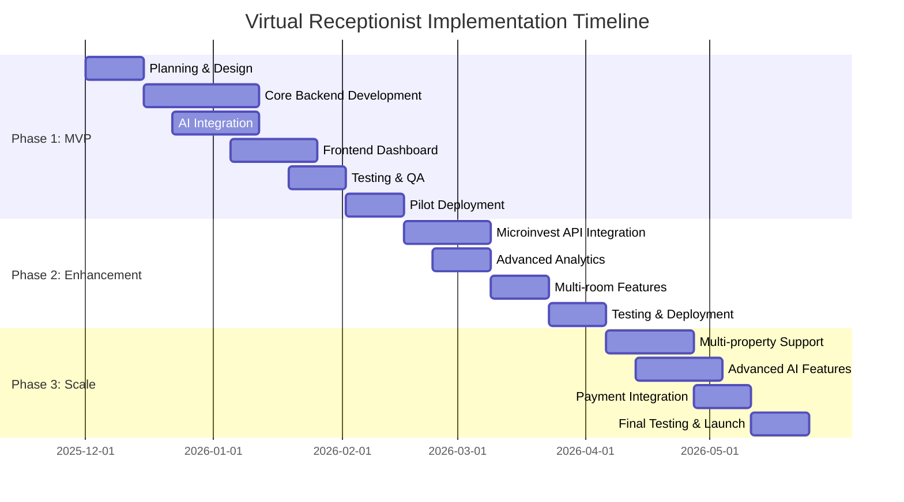

# Implementation Roadmap

## Overview

This document outlines a phased approach to developing and deploying the Virtual Receptionist system. The roadmap is designed to deliver value quickly while managing risk and complexity.

## Timeline Summary

---

## Phase 1: MVP (3-4 Months)

### Goal
Deliver a working system that can handle basic booking conversations and manage availability for a single hotel.

### Scope

**Must Have** ✅:
- Voice call handling (Twilio integration)
- Bulgarian speech-to-text and text-to-speech
- Basic conversation flow (booking, inquiry)
- Manual calendar management
- CSV import from Microinvest
- Booking creation and confirmation
- Basic analytics dashboard
- Call recording and transcripts
- Single property support

**Won't Have** ❌:
- Real-time Microinvest sync
- Multi-property support
- Payment processing
- Advanced AI features
- Mobile app

### Month 1: Foundation (Weeks 1-4)

**Week 1-2: Planning & Architecture**
- [ ] Finalize technology stack
- [ ] Set up development environment
- [ ] Create detailed technical specifications
- [ ] Design database schema
- [ ] Set up version control and CI/CD
- [ ] Provision cloud infrastructure (DigitalOcean)
- [ ] Obtain Twilio account and Bulgarian number
- [ ] Set up Google Cloud for STT/TTS
- [ ] Set up OpenAI API access

**Week 3-4: Core Backend**
- [ ] Initialize NestJS project
- [ ] Set up PostgreSQL database
- [ ] Set up Redis cache
- [ ] Implement authentication system
- [ ] Create database models (properties, rooms, bookings, guests)
- [ ] Build CRUD APIs for core entities
- [ ] Implement basic API authentication
- [ ] Write unit tests for core modules

**Deliverable**: Backend foundation with database and basic APIs

---

### Month 2: AI Integration (Weeks 5-8)

**Week 5-6: Telephony Integration**
- [ ] Set up Twilio webhooks
- [ ] Implement call receiving and routing
- [ ] Integrate Twilio recording
- [ ] Build call session management
- [ ] Implement TwiML response generation
- [ ] Test incoming/outgoing calls
- [ ] Set up call event tracking

**Week 7-8: AI Services**
- [ ] Integrate Google Cloud Speech-to-Text
- [ ] Integrate Google Cloud Text-to-Speech
- [ ] Implement OpenAI GPT-4 integration
- [ ] Build conversation context manager
- [ ] Create Bulgarian prompts and templates
- [ ] Implement intent recognition logic
- [ ] Build entity extraction (dates, names, numbers)
- [ ] Test conversation flows

**Deliverable**: Working AI that can understand and respond to calls in Bulgarian

---

### Month 3: Frontend & Calendar (Weeks 9-12)

**Week 9-10: Dashboard Frontend**
- [ ] Initialize Next.js project
- [ ] Set up shadcn/ui components
- [ ] Create layout and navigation
- [ ] Build dashboard overview page
- [ ] Implement call history view
- [ ] Create call detail modal with transcript
- [ ] Build real-time call monitoring (WebSocket)
- [ ] Implement authentication UI

**Week 11-12: Calendar & Bookings**
- [ ] Build calendar view component
- [ ] Implement availability management UI
- [ ] Create booking creation/edit forms
- [ ] Build CSV import interface
- [ ] Implement booking list and filters
- [ ] Create analytics charts
- [ ] Build settings page
- [ ] Responsive mobile design

**Deliverable**: Functional dashboard for monitoring and management

---

### Month 4: Testing & Pilot (Weeks 13-16)

**Week 13-14: Integration Testing**
- [ ] End-to-end call flow testing
- [ ] Bulgarian language quality testing
- [ ] Booking workflow testing
- [ ] Calendar synchronization testing
- [ ] Performance testing (concurrent calls)
- [ ] Security testing
- [ ] Bug fixes and refinements

**Week 15-16: Pilot Deployment**
- [ ] Deploy to production environment
- [ ] Configure monitoring and alerting
- [ ] Set up backup systems
- [ ] Onboard 2-3 pilot hotels
- [ ] Staff training sessions
- [ ] Monitor pilot usage closely
- [ ] Collect feedback
- [ ] Fix critical issues

**Deliverable**: MVP deployed to pilot hotels

**Phase 1 Milestone**: Working Virtual Receptionist handling real calls and creating bookings

---

## Phase 2: Enhancement (2-3 Months)

### Goal
Improve the system with automated Microinvest synchronization, better analytics, and enhanced conversation capabilities.

### Month 5: Microinvest & Analytics (Weeks 17-20)

**Week 17-18: Microinvest API Integration**
- [ ] Research and document Microinvest API
- [ ] Build Microinvest API client
- [ ] Implement scheduled sync job
- [ ] Create conflict detection logic
- [ ] Build conflict resolution UI
- [ ] Test bidirectional synchronization
- [ ] Add sync monitoring

**Week 19-20: Advanced Analytics**
- [ ] Build comprehensive analytics engine
- [ ] Create advanced dashboard charts
- [ ] Implement export functionality (PDF, Excel)
- [ ] Add email reporting
- [ ] Build custom date range filters
- [ ] Create performance metrics
- [ ] Implement sentiment analysis

**Deliverable**: Automated Microinvest sync and rich analytics

---

### Month 6: Features & Optimization (Weeks 21-24)

**Week 21-22: Enhanced Conversations**
- [ ] Improve conversation context handling
- [ ] Add interruption handling
- [ ] Implement complex multi-turn dialogues
- [ ] Add support for special requests
- [ ] Improve error recovery
- [ ] Optimize LLM prompts for cost
- [ ] Add conversation quality scoring

**Week 23: Multi-room Support**
- [ ] Enhance calendar for multiple room types
- [ ] Improve availability algorithms
- [ ] Add room-specific pricing
- [ ] Implement amenities filtering
- [ ] Build room comparison features

**Week 24: Testing & Deployment**
- [ ] Full regression testing
- [ ] Performance optimization
- [ ] Security audit
- [ ] Deploy Phase 2 features
- [ ] Update documentation
- [ ] Train pilot hotels on new features

**Phase 2 Milestone**: Enhanced system with automated sync and improved AI

---

## Phase 3: Scale (2-3 Months)

### Goal
Scale the system to support multiple properties and add advanced features.

### Month 7: Multi-Property (Weeks 25-28)

**Week 25-26: Multi-Property Architecture**
- [ ] Refactor database for multi-tenancy
- [ ] Implement organization hierarchy
- [ ] Build property selection UI
- [ ] Add property-specific settings
- [ ] Implement cross-property analytics
- [ ] Create property management admin panel

**Week 27-28: Advanced AI Features**
- [ ] Custom voice training
- [ ] Sentiment analysis improvements
- [ ] Predictive booking suggestions
- [ ] Automated pricing recommendations
- [ ] Callback scheduling
- [ ] SMS integration for confirmations

**Deliverable**: Support for hotel chains and advanced AI

---

### Month 8-9: Payments & Launch (Weeks 29-36)

**Week 29-30: Payment Integration**
- [ ] Research payment providers (ePay, Borica, Stripe)
- [ ] Integrate payment gateway
- [ ] Implement deposit collection
- [ ] Add refund handling
- [ ] Build payment security
- [ ] PCI compliance review

**Week 31-32: Polish & Optimization**
- [ ] UI/UX improvements
- [ ] Performance optimization
- [ ] Cost optimization (AI usage)
- [ ] Load testing
- [ ] Disaster recovery testing
- [ ] Documentation updates

**Week 33-34: Marketing & Sales**
- [ ] Create marketing materials
- [ ] Build public website
- [ ] Prepare case studies
- [ ] Set up customer onboarding
- [ ] Create pricing tiers
- [ ] Launch marketing campaign

**Week 35-36: General Availability**
- [ ] Open registration
- [ ] Onboard first paying customers
- [ ] Monitor system closely
- [ ] Provide premium support
- [ ] Iterate based on feedback

**Phase 3 Milestone**: Publicly available, scalable platform

---

## Team Structure

### Phase 1 Team (4-5 people)

| Role | Responsibilities | FTE |
|------|-----------------|-----|
| **Backend Developer** | NestJS, APIs, integrations | 1.0 |
| **Frontend Developer** | Next.js, dashboard UI | 1.0 |
| **AI/ML Engineer** | LLM integration, conversation design | 1.0 |
| **DevOps Engineer** | Infrastructure, deployment | 0.5 |
| **QA Engineer** | Testing, quality assurance | 0.5 |

**Total**: 4.0 FTE

### Phase 2-3 Team (6-8 people)

Add:
- **Backend Developer** (additional): +1.0 FTE
- **Product Manager**: +0.5 FTE
- **Designer**: +0.5 FTE

**Total**: 6.0 FTE

---

## Development Practices

### Methodology: Agile/Scrum

- **Sprint Length**: 2 weeks
- **Daily Standups**: 15 minutes
- **Sprint Planning**: Start of each sprint
- **Sprint Review**: End of each sprint
- **Retrospective**: After each sprint

### Code Quality

- **Code Review**: All PRs require 1 approval
- **Testing**: Minimum 80% code coverage
- **Linting**: ESLint + Prettier
- **Type Safety**: TypeScript strict mode
- **Documentation**: JSDoc for all public APIs

### Version Control

- **Main Branch**: Production-ready code
- **Develop Branch**: Integration branch
- **Feature Branches**: `feature/TICKET-description`
- **Hotfix Branches**: `hotfix/TICKET-description`

---

## Risk Management

### Technical Risks

| Risk | Likelihood | Impact | Mitigation |
|------|-----------|--------|------------|
| Bulgarian AI quality insufficient | Medium | High | Test multiple providers early; have human fallback |
| Twilio service disruptions | Low | High | Implement fallback provider; SLA monitoring |
| Microinvest API unavailable | High | Medium | Build CSV import; standalone calendar fallback |
| Scalability issues | Medium | Medium | Load testing; cloud auto-scaling |
| Security breach | Low | Very High | Security audits; penetration testing; insurance |

### Business Risks

| Risk | Likelihood | Impact | Mitigation |
|------|-----------|--------|------------|
| Low customer adoption | Medium | High | Pilot program; marketing; pricing flexibility |
| Competition enters market | Medium | Medium | First-mover advantage; superior integration |
| Regulatory changes (GDPR) | Low | High | Legal review; compliance monitoring |
| Hotel industry downturn | Low | High | Diversify to other industries |

---

## Key Milestones & Go/No-Go Decisions

### Milestone 1: Technical Proof of Concept (Week 6)
**Criteria**:
- [ ] Can receive and answer calls
- [ ] Bulgarian STT >85% accuracy
- [ ] Bulgarian TTS sounds natural
- [ ] LLM understands basic booking intents

**Go/No-Go**: If criteria not met, reevaluate AI providers

### Milestone 2: End-to-End Booking (Week 10)
**Criteria**:
- [ ] Complete booking conversation works
- [ ] Booking saved to database
- [ ] Confirmation sent to guest
- [ ] Dashboard shows booking

**Go/No-Go**: If not working, extend development 2 weeks

### Milestone 3: Pilot Success (Week 16)
**Criteria**:
- [ ] 2+ hotels onboarded
- [ ] >80% call success rate
- [ ] >20% conversion rate
- [ ] Positive feedback from hotel staff

**Go/No-Go**: If pilot fails, iterate on MVP before Phase 2

### Milestone 4: Market Readiness (Week 36)
**Criteria**:
- [ ] 10+ paying customers
- [ ] <5% churn rate
- [ ] 99.5%+ uptime
- [ ] Positive ROI for customers

**Go/No-Go**: If not ready, delay public launch

---

## Dependencies

### External Dependencies
- **Twilio**: Phone service provider
- **Google Cloud**: STT/TTS services
- **OpenAI**: LLM services
- **DigitalOcean**: Cloud infrastructure
- **Microinvest**: PMS integration

### Internal Dependencies
- **Database Schema**: Must be finalized before frontend
- **API Endpoints**: Must be stable before frontend integration
- **Authentication**: Required for all protected features

---

## Post-Launch Roadmap

### Months 10-12: Optimization
- Reduce AI costs by 30%
- Improve conversion rate by 20%
- Add 5+ new features based on feedback
- Expand to 50+ hotels

### Year 2: Expansion
- Add 3+ new languages (English, Romanian, Greek)
- Support 5+ hotel management systems
- Launch mobile app
- Expand to 200+ hotels
- Explore international markets

---

## Success Metrics

### Development Metrics
- **Sprint Velocity**: Track story points completed
- **Code Quality**: Maintain >80% test coverage
- **Bug Rate**: <5 bugs per 100 lines of code
- **Deployment Frequency**: Weekly releases

### Business Metrics
- **Customer Acquisition**: 10+ hotels in first 6 months
- **Churn Rate**: <10% monthly
- **Revenue Growth**: 20% month-over-month
- **Customer Satisfaction**: NPS >50

### Technical Metrics
- **Uptime**: >99.5%
- **Response Time**: <500ms API, <3s call response
- **Call Success Rate**: >85%
- **Conversion Rate**: >25%

---

## Budget Allocation

### Phase 1 (4 months)
- **Personnel**: €120,000 (4 FTE × €30K × 4 months / 12)
- **Infrastructure**: €2,000 (cloud, services)
- **AI Services**: €3,000 (development/testing)
- **Tools & Licenses**: €2,000
- **Contingency**: €13,000 (10%)
- **Total**: €140,000

### Phase 2 (3 months)
- **Personnel**: €90,000
- **Infrastructure**: €1,500
- **AI Services**: €2,000
- **Contingency**: €9,350
- **Total**: €102,850

### Phase 3 (3 months)
- **Personnel**: €120,000 (6 FTE)
- **Infrastructure**: €2,000
- **AI Services**: €2,500
- **Marketing**: €10,000
- **Contingency**: €13,450
- **Total**: €147,950

**Grand Total**: €390,800

---

## Next Steps

1. **Immediate**: Approve roadmap and budget
2. **Week 1**: Recruit development team
3. **Week 2**: Set up infrastructure
4. **Week 3**: Begin Phase 1 development
5. **Month 4**: Launch pilot program

---

## Related Documentation

1. [Technology Stack](./03-technology-stack.md) - Detailed technology decisions
2. [Cost Analysis](./11-cost-analysis.md) - Detailed cost breakdown
3. [Testing Strategy](./12-testing-strategy.md) - QA approach
4. [Deployment & Operations](./13-deployment-operations.md) - DevOps practices
